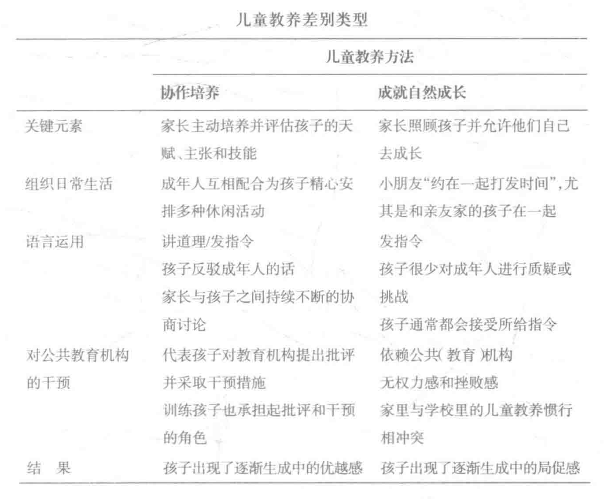

# 第二章 社会结构和日常生活

> 每个人都在各种公共机构中扮演着自我、演绎着自我，而一个人作为个体的生活，如果不以其所在的公共机构为参照，就不能被充分地了解。
>
> ——赖特·米尔斯

这本书中所描述的这些家庭，都在某一个特定的社会环境中创造了他们的生活。他们并没有去建造自己开车经过的那些道路，没有去解雇自己孩子所在学校的老师，没有下命令说哪些公园需要受到更好的保养，没有决定市政工作人员该以什么样的速度去清扫路上的积雪，没有去定下自己所在街道的房价，也没有去安排自己所在校区和邻里的种族、民族或社会地位的构成成分。他们也没有去决定自己所在地区是否有薪水高的好工作，没有去决定全国经济增长的速度，更没有去操纵美国在世界经济中的地位。然而这些元素却侵入到这些家庭的生活，虽然有些家庭受到的冲击比其他家庭要小一些。一种对这些背景环境的构想就是，每个人作为个体都在一定的社会结构（social structure）中开展自己的生活。

对社会结构的定义有很多种，但是这些定义大都强调固定的互动模式，而这些固定的互动模式又常常以社会团体的形式存在。其中最关键的基本成分是团体（或者在一个常见的定义中是“一群以对彼此共有的期望为基础而进行互动的人”） [1] 。每一个个体都在自己所隶属的（几个）团体中拥有多种由社会定义的位置，即地位。个体的行为是由各种规范（为具体情境所制定的规则或指导方针）来指引的。随着时间推移，其中一些规则系统——通过在官僚机构、法律程序和官僚规章中编码——接合成公共机构 [2] 。举例来说，婚姻、家庭、军队、企业、政党和种族隔离制度都是公共机构。在《社会学的想象力》一书中，米尔斯强调公共机构的重要性说：“大部分人类生活都是由在特定的一些公共机构中扮演……不同的角色而组成的。要了解个体的自我演绎，就必须了解他曾经和当前所演角色的重要性和意义所在，而要了解这些角色，我们就必须去了解他们身为其中一员的那些公共机构。” [3] 个体与任何一种公共机构之间互动的机会并不是随意的：有社会精英背景的家庭趋向于参与到为社会精英服务的公共机构中，而贫困家庭则倾向于参与到为穷人服务的公共机构中。有些公共机构——像动物园、欢庆游行、某些商店、有时候还加上公共交通——都是“强大的均衡器”，能够把各种各样不同的家庭拉到一起。但是，富人和穷人之间诸如此类的混杂却是相对少见的。

简而言之，孩子们是在一个宽泛而分层的社会系统里成长的。在这一章中，我将通过描写一些关键方面来勾画出参加本次调研的孩子及其家庭所在的社会结构环境。我把视野集中在两所目标学校：位于城区的下里士满小学和郊外的斯旺小学，我将分别描述这两个教育机构及其周围的社区。我还将讨论社会科学家和其他社科人员是如何解释我们社会中持续存在的不平等的。

## 下里士满小学及其周边社区

下里士满小学招收学前班至五年级的学生。学校校园坐落在东北部一个大城市的一条狭窄的街道上，看起来令人难以亲近：教学楼共有三层，并被一道高高的网链状的栅栏团团围住。教学楼很老了，里面的墙壁已经变成一种脏脏的米色，窗户也很少。墙上斑斑点点尽是油漆，以覆盖住经常出现的涂鸦乱画。学校的两侧和后院是沥青的操场和一个小篮球场，前院有一些树木和一小片草地，但是孩子们不能在课间的时候在这里玩耍。学前班有自己单独的操场，同样是一色的沥青地，但是周围有由孩子们画的壁画，看上去要更愉悦一些。学校大门外面有一个保安坐在办公桌后面。总的来讲，据一位教师说，下里士满小学是“一个很好的地方”。她注意到，这个学区的其他小学在校园里会有好多啤酒瓶子和碎玻璃碴子，比起那些学校来，[这里]“很安全；当你走进来的时候会发现前面很漂亮，有草地还有树木，还有一个停车场，教学楼也比较干净”。

下里士满小学周围邻近的住宅区把不同种族的居民隔离了开来。很多学生都来自开车十分钟以外的贫困黑人住宅工程区。而学校本身则坐落在一个主要由白人工人阶级住户组成的住宅区里，这里的大多数住宅都是小型廉价的房子。（描述性的社会和人口分布数据请参见表 C2。）这里还有一些公寓楼，其中有一部分是租给符合政府补助标准的（“住房法案第 8 部分”）低收入家庭的。在这些公寓楼里，不同的种族混杂居住。下里士满小学约有一半的在校生是黑人孩子，另一半是白人孩子。有不到 5%的学生是亚裔人或西班牙语族裔。大多数执教人员都是白人，包括校长，但是也有黑人教员，其中包括我听课的三年级老师、校内的心理顾问、掌管阅读资源的老师和音乐老师。大多数非教职员工均为非裔美国人，比如秘书、保安、清洁管理员和校车司机。大部分学生都符合免费午餐的标准（译者按：此处表明学生大都来自低收入家庭）。

离学校只有几个街区的地方，有一个小购物区，里面有几个加油站、一个比萨饼店、一个冰激凌店（只在较暖的月份里营业），一个从早上 7：00 开到晚上 11：00 的便利店和一个五金店。和其他市内的街区不同，这里的商业用房和居住用房都租了出去并有人使用，在这里并没有什么被遗弃的建筑。这是一个坚实可靠的工人阶级居民区，有狭窄的街道、老旧但保养得很好的红砖二层楼房，还有足够多的商业消费者和雇员，以至于停车位经常短缺。在单调的混凝土路面和建筑之间，也有足够多的树木和鲜花来打破沉闷并标记出四季的更迭。建筑物都密集地挤在一起。大型商厦非常少见：超级市场只是零星可见，而且也没有像焦点（Target）和沃尔玛这样的打折优惠店。居民们必须驾车到郊区才能有机会买到价格便宜的货物。

下里士满小学周围的交通十分忙乱。市内的公交巴士每小时有数次呼啸着在路上往返穿梭，小卧车飞速驶过十字路口。车喇叭时时高声作响。与地广人稀的地方相比，密集的住房和稀少的停车场使得邻里之间的接触更加频繁。许多与养车相关的活动都发生在大街上，从洗车或修车到铲去车旁的积雪都是如此，和全国大多数市区中心一样，这里的犯罪行为也引人关注，尤其是在公共建筑上涂鸦破坏、入室行窃和小偷小摸。（在大街上或当地的小店里）持枪抢劫则相对比较少见，但是其频繁程度也已足以破坏掉当地居民的安全感。

多年以来，下里士满小学在家长、孩子和教育工作者的心目中的形象一直都很不错。伯恩斯坦女士（Ms. Bernstein）是该校一位四年级老师，她说，与市内其他小学的艰苦环境相比，下里士满小学是一个“柔滑可爱的奶油泡泡”。在校方提供的条件的基础上，下里士满小学为学生提供了各种有价值的资源：一个计算机房和一个专教电脑的老师，还有专门教美术、音乐和体育的老师。学校里还有一个图书馆和一个由专门基金支持的以科技为重点的科教计划。学校主办的课外活动包括一个唱诗班和一个乐队，这两者都会在校内、区里和地方社区进行表演 [4] 。下里士满小学每年还会组织一场受人欢迎的春季教育集市。

尽管如此，这所学校也存在着自己的问题，从缺乏像纸张和美工原料这样的教学用品，到教师短缺，到能损害学生受教育的繁冗的行政机制。虽然大家都公认在市区的学校里教书要比在郊区教书更具挑战性，但是教师们的薪水（以及每个学生的花销）却要比在郊区学校里少很多。而且也不是总能找到合格的教师。下里士满小学的一些学生就对教师短缺有很切身的体会：例如，三年级的一个班就曾在一整个学年里有过一系列不同的替补老师。据学区规定，班级的名册要到新学年开始好几个星期后才能最后定下来，因而，像到十月中旬那么晚的时间，一个孩子还有可能会再分配给一个新的老师（学区为了对付教员安置和预算问题，有时会打破原有的班级并进行重新组合）。区里强加给学校的官僚政策还制造了其他很多困难。一位教师解释说，一个看上去很简单的请求就可能需要很多笨重耗时的繁文缛节：

> 一个孩子的祖母打电话来说 [一个校外课后班] 需要一些信息。而我却没有权力把任何学生的书面信息给任何人，除非我有孩子父母在 [需求该信息的机关提供的] 正式公函纸上签字的应允书。而且学校的顾问和校长也必须在上面签字， [5]

家长（和教育工作者）也常常对学区的教学指导方针感到迷惑和失望。比如说，一个学生要被推荐去参加全天特殊教育，就首先需要两次先遣推荐（每一次都要在不求助于全天特殊教育干预的情况下，并在使用普通教育方法努力改善后还无济于事的时候才可进行推荐），然后才可以正式审核一个孩子是否需要特殊教育。由于每一个阶段都至少需要 60 天，而每一学年又只有 180 天，以至于有时整个一学年都消磨过去了也不见得能等到一个明确的决定。就像我在本书后面所展现的，诸如此类的官僚构造带来的结果有时候就是，当他们在学习上存在的问题也无法得到对症解决时，孩子们就“被体制给抛弃”了。

在调研进行中的那一年，一些地方政客就曾公开批评这个学区没有做好学校教育。即使在像下里士满小学这样在这个学区很有成就的学校，也有大约一半的学生没有达到所在年级的阅读水平标准，四年级组约有三分之一的学生比该年级应有的水平低至少两个年级。区里在提高考试成绩方面面临着很大的压力，但是财政预算却十分有限，而且每年都不够。和郊区的学校不同，市内的学校没有富有的家长联合会为它们吃小灶补充资金。在下里士满小学，很少有家长参与家长联合会；每次开会都只有三四个人参加（通常只有头目们到场）。教师之间的人际关系也潜伏着另一个让人担忧的问题。在通常还很热情的氛围里潜伏着严重的紧张关系。一些黑人教师觉得白人教师对某些黑人孩子不公平。一位三年级黑人老师气愤地控诉说：

> 有一些教学人员——有些孩子没有得到公平的待遇。一些名声不好的黑人孩子做了某些事情以后……[被] 开除学籍。一些白人孩子会犯很严重的错误，而他们所受的处罚却只是在放学后被留堂、请家长或是停学检查。虽然白人领导和白人教师大都不同意这种看法，其他黑人教师却都重述了同样的担忧和困扰。

有时候，下里士满小学学生之间的关系也很紧张。严重威胁安全的行为很少见。 [6] 但是，每个星期，孩子们在操场上的拳脚之争却是屡见不鲜。老师们估计，至少有一半孩子在生活上有严重问题，通常涉及没有自理能力或缺失的家长。学校的心理顾问定期与儿童保护机构合作以帮助那些在她看来被忽视需要照看的或是受到虐待的孩子（例如，那些没有穿大衣就来上学的孩子）。仅仅在一个班级里，通常就有好几个孩子存在“严重的问题”。在蒂尔先生（Mr. Tier）的四年级里，就有很多这样的白人孩子。莉萨的妈妈不要她了，她现在“和她的父亲一起住，而这个当爸爸的总是喜欢过量饮酒”。托马斯的妈妈有一天突然就消失了，虽然她最终还是出现了，但她始终没有和自己的儿子取得联系。还有坦妮莎，她甚至没有老师希望每个孩子都有的最基本的学习用具（比如书包）。另一个叫托娅的学生，经常扰乱课堂，她“总是在和别人打架……但是她的妈妈……[不但不呵责她，反而过来花时间] 向我解释为什么这些都不是托娅的错”。朱利叶斯来自一个“有很长的吸毒和暴力历史”的家庭。下里士满小学的老师们还注意到，这些学生在生活上的问题，除了在感情上令他们苦恼之外，还扰乱了全班的学习进度。老师们一致希望他们的学生每天都“干净整洁”地来校上课，并要“为学习功课做好准备”。用一位四年级老师的话来说就是，他们还希望家长能参与到孩子的教育中来，“在家庭作业上签字，帮孩子做课业项目”，并且还要“抱有积极的态度”。

还是有一些家长可以实现老师们提出的这些期望的。有不少黑人和白人家长都有稳定的工作，还有一些家长正在积极地谋求在社会上更好地立足。蒂尔先生的班上有三名黑人学生——艾赛亚的妈妈不要他了，但他爸爸却在一心一意地照看他，莫雷尔的妈妈已经“回去读大学以成为一名小学教师”；还有丹尼艾尔，她的妈妈在“乔的牛排店”工作。有很多白人孩子的家长也是如此，包括那些被蒂尔先生称作“呈上升趋势”的父母。

总之，下里士满小学有很多值得肯定的方面，尤其是和学区里的其他学校比起来。尽管如此，这所学校也与其他市内的学校一样，存在很多实质性的局限性，比如说教师短缺、教师工资偏低、学习用品缺乏和繁冗的官僚制度。家长无论在经济上还是在政治上都不是学校教育的主要力量。学生们来自种族之间互不杂居的居住区，在这些居住区里，历史上遗留下来的土地使用模式和市场的压力限制了大型商店存在的可行性，这里的住宅很小而且都挤在一起，交通很混乱，犯罪率通常也让人担忧。因此与像斯旺这样的郊区学校相比，下里士满小学就要显得逊色许多。

## 斯旺小学及其周围环境

和下里士满小学相同，斯旺小学也招收从学前班到五年级的学生。该校坐落在下里士满小学所在的东北部某大城市边缘的一个郊区小镇。与很多其他的郊区学校一样，斯旺小学是平铺而伸展着的。学校里只有单层的建筑，都在校园的各处延展开来。每一间教室都有一整扇墙排满了大窗户。虽然所有的窗户都可以打开，但是在秋天和春天的时候（冷气不开放）教室里仍然会很闷热。教学楼外面是一片宽广的草地，缓缓地沿着小山坡舒展开去，面积之大，足可以让孩子们同时进行好几项运动而互不干扰。和下里士满小学不同，斯旺小学的操场上有一套功能繁多做工精细的秋千和横木，横木下面还有微微发红的碎木屑以便在孩子们不小心摔下来时起到保护作用。斯旺小学周围并没有篱墙，整个学校看上去显得开阔而有吸引力。

斯旺小学所在的居民区里都是单层的独门独院的中产阶级家宅。每座房子前面都有一大长条绿色的草坪。这里的房价比下里士满地区的房价要高出两倍（详细数据请参见表 C2） [7] 。除了有活动的时候家长们的私家车会挤满校园之外，这里的土地显得十分充足。学校的校园和周围临近的住宅区都有大片大片美化得很好的绿地。这里有很多很多的树木、开花的灌木和各种花卉，每当季节变换，大自然的存在简直无法抗拒。秋天的时候，深橘色的落叶铺满了大地，春天一来，当高处粉色的、白色的山茱萸猛然盛开的时候，地上则成了水仙花的海洋。

斯旺小学及其周边地区没有可以徒步到达的商店。当地的商业区位于一条主干道的两侧；商店都是巨型的，并且在大型停车场的后面，离主路本身还有一段距离。购物的人可以选择很多不同的零售商，包括好几个折扣店。比起城里的店来这里的货品更齐全，价钱也更低。因为商店太大了，每家在从一个商店到几街区远的另一个商店时，常常要开车前往。孩子们参加各种活动需要车接车送，而且连到小朋友家去玩也不例外（但也有一些孩子能得到家长允许骑车到小朋友家去玩）。虽然这个市郊的生活都很依赖于私人汽车，但是这里几乎从不堵车；而且比起城里人来，这里的居民开车的时候更加安详舒缓。道路的状况也比下里士满附近的明显要好得多。市郊公路上坑洼不平的地方要少得多，扫雪也更为及时，常常能在暴风雪过后的二十四小时之内统统扫清。因此，一月份的时候，当下里士满小学的停车场一连几天都盖着危险的冰层时，斯旺小学的停车场却完全没有冰雪覆盖。

在访谈当中，市郊的一些成年人提到，他们认为市区非常之“危险”，还说他们会尽量避免进城。尽管家长们都为犯罪行为而焦虑，尽管他们都担心孩子的安全，这里的家庭却通常会把像自行车、棒球手套或球棒这样值钱的物品扔在院子里不管。入室行窃和小偷小摸很少在斯旺小学周围的地区出现，在居民区内持枪抢劫几乎是闻所未闻。总的来说，这里的人并不像城里人那样担心各种犯罪行为。

斯旺小学周围的居民绝大多数都是白人，但是也有一些黑人家庭、黑人学生几乎占到在校生总数的 10%（另有不到 5%的亚裔和西班牙语裔学生）。“多元文化”的主题在校内占支配地位，学校的拼布壁挂、海报、集会活动和课程都致力于这一主题。尽管学校密切注意提倡多元文化，但是这里的多元化在很大程度上都是象征性的，因为和下里士满小学不同，在这里几乎所有的学生、教员、管理人员和服务人员都是白人。

家长们和学区主管们对斯旺小学及其所在学区都评价极好。返校日的晚上，副主任着重讲述了斯旺小学的这种极为显著的“特别好感”，并强调，学区十分注重听取家长的心声。他把自己的电话给了在座的家长，还鼓励他们给他打电话。比起下里士满小学的老师，斯旺小学的老师们有更多的教学用品，他们有复印机，还有充足的纸张和美术用品。推介孩子接受特殊教育并不那么普遍，也没有那么多官僚的繁文缛节。家长仍然必须（通过在许可表上签字来）正式同意让孩子参加学习困难的测试，但是书面审核工作通常只需几个星期，而不是几个月，就可以处理好。在斯旺小学，大多数四年级的孩子，包括那些成绩差的，都达到了四年级的学习能力标准，在阅读方面，很多学生都超过了四年级标准两到三年。虽然下里士满小学和斯旺小学都提供电脑训练课、美术课、合唱团和体育课，但是斯旺小学在课程性质、教学用品和教育内容方法上都更精工。比如说，在下里士满小学，学生们用冰棒的木棒做美工。而在斯旺小学，孩子们用白色的方布和黑色的墨水来做写有日文字的标幅。下里士满小学的合唱团对所有来参加排练的学生开放，孩子们在当地的养老院表演。斯旺小学的合唱团是“选拔”出来的，孩子们必须通过试音才能得到席位。得力于一次大型的募捐活动，斯旺小学的合唱团乘专车到中西部地区参赛演出；而且在音乐老师的安排下，孩子们还在该学年内参观了一个录音棚。最后，斯旺小学的家长参与度也远远高于下里士满小学。这两个学校在规模上不相上下，但是，斯旺小学的家教联会（即家庭教师联合会）却比下里士满小学的参与者多十倍，而且郊区的这个组织在集资（和消费）上都比城里的家教联会多得多。比如说，斯旺小学的家教联会每年要花费 3000 美元左右为学校提供增补集会。他们赞助了“住校艺术家”及木偶表演、话剧和其他的专业表演。他们还为年度的学校信息集市提供帮助，斯旺小学的信息集市比下里士满小学的要精致得多。

即便如此，斯旺小学的家长和老师们还是有怨言，虽然他们要抱怨的问题与下里士满小学面临的困难有所不同。在斯旺小学，经济方面的安全感不是问题。这里的孩子大都生活在父母双方都有正式工作的家庭，很多家长都是像律师、社会工作者、会计师、经理、教师和保险公司主管这样的专业人员。很多孩子的母亲在外面做专职工作。学校里有些老师担心孩子们在家里会因为父母“太忙了”而得不到足够的关注。内特尔斯女士（Ms. Nettles）注意到，在新学年刚刚开始的前几个星期，她班里的二十六名学生中就有十个没有做家庭作业；她评论说：

> 我在这个学校已经有七年了，这种现象已经愈演愈烈。家庭生活出现了很多变化，很多家庭都变成了双职工家庭还有单亲家庭。家长回到家里，显然会因为劳累而不愿再去督促孩子去做 [家庭作业]。

家长还经常会对孩子的成绩及能力估计过高。比如说，他们说自己的孩子觉得功课太容易“太没劲”了，而从老师的角度看，这些孩子并没有熟练掌握课业内容。而且，家长们还会过于仓促地对老师进行批评责备。教三年级的内特尔斯女士汇报说，—个高材生的母亲听说她女儿的成绩受到了高声批评，感到十分愤慨：

> 一天，她到学校来 [抱怨] 我把克洛伊的低分 86 分在班里 [高声地] 读了出来，她说我让克洛伊很难堪——因为克洛伊不可能得 86 分。

这位老师觉得孩子的母亲对自己女儿的成绩没有正确的评价：

> 克洛伊是一个非常非常聪明的孩子，但是在加减法的预测中，她才得了 58 分。她妈妈却告诉我她觉得这些太简单了没意思。“克洛伊早都学过这些了，她已经算得很好了”。当我把她得了 58 分的卷子给她妈妈看的时候，她简直是震惊得不得了。

家长们严密地注视着老师们的教学工作而且总会毫不犹豫地替孩子说话。一位三年级老师报告说：“孩子们的母亲受到家教联会的影响。[校长] 自己也说过，家教联会总是带来很多麻烦。你知道，那个联会是个组织很严密的小团体。”家长们浓厚的优越感在老师们眼里显而易见，正像这位斯旺小学教员在下面所解释的那样：

> 这些家长们，他们当中有好多人都好自我中心哦！当然并不是所有的人都是如此，但是有一些人，他们已经把自己这种自我中心的东西传给了他们的孩子。简直就像是，“你欠我的。现在你得替我做点儿什么才能补偿给我呢？”……或者，“你有什么理由这么做？你欠我一个说法。”有时你简直觉得自己不得不为自己辩护。

家长和教师之间不时发生冲突。比如，合唱团的老师觉得那些在孩子们表演时还在后排聊天的家长十分无礼。她在节目单的内侧为前来观看演出的家长加入了几条有关观众文明举止的建议，但是由于家长对此怨声载道，校长就把这些建议都删掉了。一些起初资格考试成绩并不符合天才班标准（斯旺小学的分数线是智商为 125）的孩子，他们的家长还会私底下另请他人为孩子再测试一次，这样的事情屡见不鲜；如果孩子在私人测试中得分符合了标准，家长就会坚持让孩子加入到天才班。为了减少各种矛盾的发生，校长（家长们觉得他有时候太护着学校老师了）会事先采取行动，给家长们打预防针，比如说，致信给家长并请他们在下一学年的班级分配问题上尊重教育工作者的职业判断力：

> 你知道，校长的确在信中告诉了家长，所有的因素都会被考虑进去的，但是恳请各位家长在下一年的分班问题上尊重他和他的教员们的判断力。因为那些让孩子进入天才班的要求，会把事情闹得不可收拾。真的会是这样的。

斯旺小学的学生家长与下里士满小学的相比，其参与程度之高令人瞩目；可是积极参与学校活动的家长们却抱怨说，为各种活动征集足够的志愿服务员总是会遇到很大的困难。学校的活动有很多，比如，“和爸爸一起吃多纳圈”、每年一度的三年级学生和妈妈一起吃午餐、家长们组织的谢师午宴，以及全校的春季信息集市 [8] 。

由此可见，斯旺小学的日常生活也不总是一帆风顺的。家长埋怨老师，老师也在埋怨家长。为学校的众多活动征集志愿者是一件很辛苦的工作。尽管如此，总的来说，这个学校享有很多下里士满小学无法得到的社会结构资源。教师工资更高，没有教员短缺问题，教学用具十分充足，而且老师们还可以复印教学资料。尽管斯旺小学在自有资源上已经超过了下里士满小学，家教联会还是进一步为学校增加了更充足的资金。该联会集资数千美元，使学校能够为孩子们提供专业水平的美术班和音乐班。

总之，这两所研究对象小学在关键的结构资源上存在着重大的差别，包括物质设备上、教学用具上，以及后续资金及家长的贡献与志愿参与上。 [9] 如果社会地位不起紧要作用的话，这些差别就会是无规律地随机分布的。然而事实却并非如此。在全国范围内，家长的平均社会地位较高的社区，都拥有声誉要好得多得多的公立中小学系统。 [10]

## 已确立的职业惯例和教育机构制定的标准

虽然这两所学校之间有很大差别，但是它们也有很多相似之处。美国的小学有很多一致的成分，比如说，包括教学日的组织安排都很相近。下里士满小学和斯旺小学的老师们看起来都对什么是恰当理想的童年经历拥有类似的看法。大体上他们都同意，家庭应该在促进孩子的教育发展上担当起恰当的角色。这些前提并不仅仅是教育工作者对自己个人信念的一种表述，而更是他们对一整套已受到教育界普遍赞同的文化惯行的一种附和。 [11] （译者按：惯行，即“惯常行为”，这里的“practice”一词在本书中并非指与“理论”相对的“实践”，而是指“按照惯例／习惯去行事”。）

总的来说，老师们都支持协作培养的惯行，强调通过有组织的活动来发展孩子的能力、通过说理和阅读增大孩子的词汇量，并鼓励家长积极参与学校教育和家庭以外的各种文教机构组织的活动。教育工作者每天都会有选择性地对孩子提出表扬，在闲聊中对他们父母的教育方式或褒或贬，并遵从那些学校和区里制定的编有特定教法的成规。教师们在教育自己的孩子时，也会遵从协作培养的规范。正如我下面要展示的，在有限的取样里，下里士满小学和斯旺小学的教育工作者在这一点上保持着惊人的一致。

## 重视培养孩子

教育工作者对家长们为培养孩子的技能才干而在课外作出的努力都相当支持。在访谈中，两个学校的老师们都汇报说，他们认为孩子参加有组织的活动对其成长很有帮助：

> 他们都需要一些动手动脑的活动。我认为参加这些活动是好的，因为上手操作的活动可以刺激心智的发展。音乐课可以帮助孩子集中精力。我认为参加校外活动是件很好的事情。
>
>这个世界上各种各样的事情真的是太多了。你让他们接触得越多就越好——说不准将来这群孩子里就会出现一个剧作家呢。就算不是为了将来的工作着想，他们现在也很喜欢参加这些活动。他们只需去了解并且去谈论那些各种各样的才能和职业就可以了。

在这两所学校里，学生的校外活动常规性地涌入校内生活中。内特尔斯女士要求她的学生写班级日志。校外活动就是其中一个常常出现的主题，正如 10 月 11 日的实地记录所述：

> 班里的五个男孩子写的全部都是有关足球比赛的内容。其中一个说：“比赛之后我气恼极了，因为我们输了。”另外四个女孩中有两个写了与足球比赛有关的事。

在下里士满小学，正当孩子们排好队准备休息时，温迪·德赖弗向她的三年级老师格林女士骄傲地描述了她的舞蹈表演会。她还带来了自己得的奖杯给格林女士和班里的同学看。比起那些像让孩子在院子里玩球或是看电视等等的随意玩耍，成年人更重视像体育竞赛和舞蹈表演会这样有组织的活动。当孩子们主动告诉老师他们看了某个电视节目或是和表亲的孩子玩了什么游戏时，老师们并没有对他们表示那么高度的兴趣或赞许，而如果孩子们告诉老师他们参加了一个有组织的活动，老师则会对他们大加赞赏。

老师们也以身作则，对自己的孩子进行协作培养，给他们安排了满满当当的日程表来参加各种有组织的活动。下里士满小学的老师斯坦顿女士让自己的一个女儿在离斯旺小学很近的一所市郊小学的四年级班上学。她女儿要参加的各种活动就和本项调研中其他中产阶级孩子的十分相似：每周常规的活动有美术班，舞蹈班，音乐班，主日学校，教会青年唱诗班，还有马术班。另一位三年级老师说，她让自己所有的孩子都上天主教讲习班（基督教义团会——译者按：CCD 为 Confraternity of Christian Doctrine），童子军，少小联盟，钢琴课和游泳队。老师们通过自己在家庭中的言行，展现了他们对协作培养这一教养逻辑的信奉与投入。

尽管如此，老师们还是会抱怨协作培养削弱了学生在学校的学习体验：孩子的日程安排得太满，而且孩子们由于太累了或是有活动要请假而不能顾及到学业。一位斯旺小学的老师感叹道：

> 足球经常抢占家庭作业的地位……有时候他们要在周末到其他地方去比赛。孩子们踢足球，晚睡，然后就很疲惫。我喜欢让他们参加体育运动，但是当孩子的学习受到影响，我认为我们应该重新审视课外活动的地位。
>你没有办法同家长们作无谓的斗争。孩子是他们的，他们可以让这些活动影响孩子的学习。汤米·丹尼尔斯今年就请假跟着家人度假三次，每次都有足足一个星期。然后她 [他的妈妈] 居然还为他的数学成绩担心！嘿，让他每天都来上学就对了。

老师们还支持家长努力发展孩子的词汇量。他们都鼓励家长为孩子读故事，带孩子去图书馆，给孩子买书，确保孩子在家里看课外书。下里士满小学教四年级的伯恩斯坦女士给她的学生留的一项家庭作业，就是每天晚上至少要读十分钟的书。斯坦顿女士同样在教四年级，她在给孩子父母列单建议孩子的圣诞节礼物时，都在其中包括了图书。在斯旺小学，内特尔斯女士有一个公告牌，她在上面列出了学生近期必读的课外读物。

相比之下，老师们并没有直接对家长强调和孩子讲道理的重要性（他们并没有指定家长必须对孩子采取说理的教育方法）。即便这样，仍有众多迹象表明，下里士满小学和斯旺小学的教师们都强烈建议要用语言来和孩子讲道理，而不是对孩子下达命令。在课堂上的互动中，这些教师和全国各地所有的教育工作者一样，常常对孩子使用讲道理的方法，尤其是在讲课文时更是如此。老师们在以文句的方式回答孩子的提问时 [12] ，努力去通过常规性的互动来发展孩子们的说理能力。而且，老师们大都（虽然不是一律）支持家长把“叫出去暂停”作为一种惩罚方式。

## 教育机构中的干预

老师们希望家长参与孩子的在校教育，尤其希望家长能督促孩子写作业。在斯旺小学，学生必须每天都让家长在作业上签名。老师认为，父母不出席家长会就是不重视孩子的学业——虽然在下里士满小学家长会都是临时匆忙通知的，也没有在时间安排上听取家长的意见。在强调家长要配合学校教育孩子这方面，这些教师的言行反映了教育界的一贯做法。 [13] 即便如此，老师们仍会根据自己的偏好去选择孩子父母的参与方式，正如下面这位下里士满小学的四年级老师所说：

> 一个不支持学校工作的家长就会和老师对着干。我就遇到过这种情况。家长的敌对行为让老师简直无法做工作。如果你要管教孩子，而孩子的父母不支持你或者不支持学校的立场，孩子就会和你发生争执，拼命和你作对，从根本上来说就是：“我不需要听你的话，我不需要按你说的去做。”

斯旺小学一位三年级的老师在表达自己的忧虑时所说的话，和上面那位下里士满小学的老师惊人的相似：

> [家长们] 现在总有这样一种态度，他们怀疑得太多了。孩子们耳濡目染着这一切，因此他们也把这种态度带到教室里来。虽然这样的孩子并不太多，但你的确总能马上感到这种态度的存在。一些孩子的确如此……我认为这在很大程度上是家庭带给他们的影响。

虽然老师们希望家长能在琐事上给予正面的和恭顺的支持，但是他们同时也更特别希望家长能按他们的要求多多督促孩子的学习。让伯恩斯坦女士感到失望的是，真正给孩子读故事书的家长竟然如此之少：

> [家长们都] 希望自己的孩子在学校里成绩优异。他们都说希望孩子完成家庭作业。他们总是这么说，但是在很多情况下他们并不知道该怎样去实现这些希望……他们就是想要……就是想要。但是他们有没有坐下来给孩子读过书？不过他们的愿望确实是好的。

两所学校的老师都认为，家长应该在解决孩子的教育问题方面起到领导性的作用。他们抱怨说，家长对待孩子的问题不够“严肃认真”，也没有主动就此类问题与老师联络。简短来说，老师们希望从家长那里得到自相矛盾的行为：遵从和支持老师的决定，同时又要在孩子出现问题时果断地承担起领导性的角色。

不仅如此，在法律上，当一个家庭违反了所在州的儿童教养标准，教育工作者还有义务采取干预措施。一些在历史上较早时期全社会都很普遍的儿童教养惯行（例如，痛打孩子），在当今则被认为是不妥当的。无论老师们自己有什么看法，比如说，如果孩子因被父母责打而带着身上鲜红的伤痕来到学校，老师都必须依法把孩子交给有关部门。在后面的几章里我将向读者展示，这一法律上的要求把本项调研中的工人阶级和贫困家庭置于了一种不利的地位：比起中产阶级家庭的父母来，校方的官员更容易通过法律手段来干预他们教养孩子的行为。

总之，孩子和他们的家庭在这些情况下都面临着一个自相矛盾的局面。一方面，各个学校之间的教学质量存在深刻的差别。另一方面，各个教育机构在文化技能库方面则接受并推崇同样的标准。因此，老师们都强调要通过有组织的活动来培养孩子的才能，强调由父母来发展孩子的词汇量的重要性，强调父母积极和正面地配合参与学校教育的重要性。后面我们将会看到，这些标准更照顾中产阶级的文化惯行，而对工人阶级和贫困家庭则很不利。这种模式使得中产阶级的孩子和他们的家长能够更安逸地，有时甚至是更容易地实现他们的心愿。

## 不平等

下里士满小学和斯旺小学在日常教学和生活方面的差别，是在更广大的社会范围内普遍存在着的不平等的一部分。整个人口中相对少数的人以及如学校这样的公共机构占有比其他人和其他机构要多得多的资产。比如说，各个家庭之间在关键性资源上的分配是不平等的。孩子家长的收入和财富、受教育程度和工作环境的质量都存在着显著差别。如果说不平等在美国并不是一种强大的力量，那么，这些令人垂涎的资源就会以一种更加公平的方式进行分配。

在收入和财富方面，在我们这个社会上仅占 10%的富人家庭就占有了近 80%的（除了自家住房之外的）不动产、超过 90%的有价证券、约 60%的银行存款。 [14] 一项广泛应用的收入不平等指标就是儿童贫困率，该指标严重依赖于社会政策。（比起大多数西欧国家来，美国有更多的贫困儿童。） [15] 在美国，有五分之一的儿童生活在贫困线以下，贫困线以下的黑人儿童大约是白人贫困儿童的两倍 [16] 。在 20 世纪末的几十年里，收入和财富的分配更加严重地集中到少数人手中。 [17] 虽然如此，在调研期间，有七分之一的黑人年收入在五万美元以上 [18] 。

受教育程度也十分不平衡。在美国，只有不到四分之一的成年人读完大学获得学士学位；与其他年龄组相比，20 岁年龄组有更多的人持有学士学位。有高于 10%的高中生辍学。 [19] 即使在年轻人中间，虽然现在有越来越多的年轻人接受大学教育，但是大多数人（从三分之一到四分之三的人）显然都毕不了业。 [20] 虽然有些研究表明，如果把家长的社会地位也考虑在内，黑人青年比白人更愿接受高等教育，但是总体来说，黑人孩子的受教育程度还是差得很远。 [21] 在高等教育内部也存在着相当大的阶层差别，从社区学院到精英级的综合大学，差别很大。学生越从更好的大学毕业，就越会得到更丰厚的报酬。 [22]

此外，美国经济和世界经济也一直都在发生着深刻的变化，薪水高的“好工作”越来越少，养老金锐减，医疗保险越来越差，晋级机会非常少，而且工作也缺乏稳定性。 [23] 在大多数人的生活中，这些似乎各不相干的线索——受教育程度、所从事的工作和薪金多少——都十分紧密地交织在了一起。这些因素一起构成了家长们的社会地位和他们在社会结构中所处的位置。

很多学术研究都表明，父母在社会结构中的位置对其子女的人生机会有着深远的影响。比如说，在上学前班之前，父母受过高等教育的孩子更有可能会在学习技能上表现出他们已经做好了“教育准备”，像熟记字母表、认识各种颜色、能从一数到二十、会写自己的名字（译者按：此处所指的名字不含姓氏）。 [24] 学校教育对孩子的成长很有帮助，在学年当中孩子学习成绩上的这种差距会缩小很多（但是在暑假中又会被拉大）。在他们的整个学业中，母亲受过高等教育的孩子一直比母亲受教育程度不高的孩子成绩好。当这些年轻人为升入大学而参加学术能力测验和学术评估测试时，这一差距也是大得惊人：（相对于 500 分的总平均分来说）父母高中肄业的孩子和父母有研究生学位的孩子之间平均相差 150 分。 [25] 依照父母的社会结构位置，孩子在学校里其他方面的表现也存在着差别。 [26] 很多研究都论证了教育成功在决定事业成功上所起到的紧要作用。父母的社会地位能够预示孩子的在校教育成功与否，进而也能预言他们最终的人生际遇。 [27]

## 如何去理解不平等

在美国很多人都认为，美国社会从根本上来说是开放型的。他们相信，每个人都可以用自己的辛勤劳动、自己的努力和自己的才干来为自己开拓生活道路。所有的孩子都被看做是拥有近乎平等的人生机遇。或者，如果孩子们的人生机遇看上去有不同之处，这种不同也会被看做是天赋、主动性、抱负和勤勉程度上的差别。这种观点直接回绝了本书的主题，即家庭在社会结构中的位置有规律有系统地塑造着孩子的生活体验和人生成就。与本书相反，大多数人都认为，每个人在自己一生中所取得的成绩如何，只应由他们自己来担当。

一些社会学家则持有第二种观点，他们承认社会上存在着各种形式的重大的不平等。他们很适时地注意到家长在受教育水平、工作经历，收入和其他因素上的种种差别。但是这些社会学家，比如像保罗·金斯顿（Paul Kingston）就在他的《无阶级的社会》（The Classless Society）一书中辩论说，这类不平等最好被理解为一连串互不关联的局部社会模式。换言之，这些学者采取了一种等级渐次（gradational）法。他们认为把社会差别按程度分层是有帮助的。采用更强硬的说法来表达就是，他们认为旗帜分明地去定义社会地位的类别，在理解家庭中“有界定人生之重大意义的体验”时毫无用处。另外，金斯顿等人还不相信这些渐次出现的差别会聚合成一个跨层次的有序的整体。相反，他们只看到了偶然割裂的局部模式和到处任意出现的结果，但却看不到清晰确定又涵盖全局的整体社会模式。 [28] 那些加入金斯顿这一研究方法阵营的人都强调，在某个经济范围内地位相似的人看来，“阶级意识”或“阶级认同感”是不存在的。从历史的角度来看，这些学者声称：“阶级共通的方面，即阶级亚文化和周边环境，早已经消失了。” [29] 这些社会学家根本就不相信不同的社会地位之间存在着清晰可辨的、明确的差别。

然而，这些主张的一个问题就是，他们所援引的调研都只是破碎不全的和太过特殊的。社科人员在评估事物间共有的联系时，汇集多项调研并把它们整合成了一个互不相配的、七拼八凑起来的解释。在这里我们需要思路不是那么狭窄的调查研究。具体来说，为了确定社会地位是怎样在儿童的生活中起到重大的作用的并且也为了认可那些生活中根本不受社会地位影响的领域，我们就必须有从大处着眼来调查社会生活的学术研究。简而言之，我们需要一幅更具整体性的图景来精确地反映出家庭和阶级之间的各种力量，这些力量之间既有能够相互渗透的，又有不能相互渗透的。而且，这样的学术研究既需要概念理论方向上的指导，又要有切合实际的期望值以允许具体调研有发生偏差的可能性。

在本项调研中，我和我的助理们追踪并深入研究了一小部分家庭，以便了解他们日常生活的节奏。根据已收集到的数据，我揭示了如下的主张：以本阶级的成员资格来定义的在社会中处于同等经济地位的人，他们在教养孩子的文化逻辑上与处于其他经济地位的人存在着明显差别，这些差别与社会经济地位紧密相连。遵从于一个已经很完善的西欧哲学传统，我为本项调研提供了一种范畴分析法，把各个家庭按社会类别分成中产阶级、工人阶级和贫困家庭 [30] （关于本项调研中的这些类别是如何定义的，详见表 C1，附录三）。我认为这种方法比美国学者通常采用的等级渐次分析更有价值。 [31] 此外我还将展示，家庭生活中的阶级差别表现在很多截然不同又十分独特的领域之间，而社会学家们通常并未把这些领域放在一起来分析。

特别值得一提的是，我描述了两种教育模式：中产阶级家庭的协作培养和工人阶级与贫困家庭的成就自然成长。表 1 提供了一个关于本书主要论点的总纲。它暗示我们，协作培养必须强调让孩子参加有组织的活动，在家中发展孩子的语言和说理能力，并对孩子的学校教育主动进行干预。与此相对，成就自然成长描述了一种松弛的儿童教养形势：孩子们经常和亲戚的小孩“约在一起打发时间”一起玩耍，父母给孩子下达清楚的指令并且没有多少可商议的余地，在家庭以外的公共机构里，家长给孩子们更多的自主权来管理自己的事情。这些模式可以帮助我们揭开日常生活中社会地位可以传送优势的机理。在讨论这些重要问题的时候，我一直深受已故学者皮埃尔·布迪厄及其作品的指引（对其理论思想的简短说明，参见附录二）。 [32]

尽管孩子们在社会结构中的生活经历存在着很多差别，他们生活中的一些重要方面却**不会**因阶级不同而有区别，这些相同之处包括看最喜欢的电视节目、在像麦当劳这样的快餐店吃快餐，对某个特别的娃娃或是玩具人物模型感兴趣，以及急切地盼望万圣节和家中重要节日的到来。正如我将在后面的章节里所展现的，所有的家长（无论其社会地位如何）都要面对很多繁重的任务，比如叫孩子起床、帮孩子穿衣服、做饭给孩子吃、送他们上学，而且还要在孩子生病时带他们去看医生和照顾他们。因此，有些经历是所有的家庭在生活中所共有的。然而，社会地位仍然深刻地影响着日常生活的步调和节奏。在下一章中，我将通过审视加勒特·塔林格的生活来研究中产阶级的家长如何通过有组织的闲暇活动来努力发展孩子的才能，并由此展现家长的这种努力是怎样造成一种狂乱的家庭生活的。

## 注释

[1] William Kornblum，Sociology：The Central Question，第 72 页。

[2] Jepperson 把公共机构定义为“一种已经达到了某种状态或得到了某种特性的社会秩序或模式……换言之，在按时间顺序进行的再生产中，公共机构是那些因为有相对自行起始的社会过程而存留下来的社会模式。”Ronald L Jepperson 的文章“Institutions，InstitutionalEffects， and Institutionalism.”第 145 页。

[3] C.Wright Mills，The Sociological Imagination，第 161 页。

[4] 下里士满小学的老师们还与一个在当地住房援助项目里的课后辅导班合作，针对课堂教学协调课后辅导内容，虽然这并不是一个学校正式出资开展的活动。

[5] 本书中大多数引用当事人的话都来自采访或观察录音。有时候，沿袭传统的人种学研究，节选的引文来自我和研究助理在观察后马上写下来的实地笔录。在这样的情况下，我们只在确定自己能一字不错地记住对话时才加上引号。因此，有些从实地笔录中摘取的话语并没有放在引号里。（在实地观察的时候，我自己不带笔记本也不允许其他人带，我们只是与他们一起“待着”。）在编辑引文的时候，为了阅读的流畅，我删除了那些对分析数据并不重要的口头禅和磕巴重复，如，“嗯”、“你知道”和“就像”等等。省略号代表某词语有删减（有几例是语序有轻微变动）。最后，我和研究助理都在实地笔录中给参加调研的家庭成员起了不同的绰号（例如，“塔林格先生”、“塔先生”和“唐”）。我并没有更改实地笔录，而是保留了这几种不同的叫法。 实地笔录中的中括号是我插入的文字，通常是为了澄清事情，比如当用名字代替人称代词的时候，或者在写书的过程中作为一个旁注。小括号是研究助理用来表述旁注的，这些是在做实地笔录的当下加上去的。

[6] 比如，在一次拼写测验中，一个三年级孩子造了一个句子，在句子里他说他想杀死他的老师。这件事非同寻常，也在楼道里激起了很多议论。

[7] 在 1990 年的普查中，与下里士满地区的 7.5 万美元相比，斯旺的平均房价为 16.05 万美元。比起很多市区的房价来，这个地理位置的房价并不高，到现在为止也是如此。

[8] 有组织的活动中志愿服务的家长也有类似的抱怨。一位管理当地童子军的父亲就因为有很多家长都“把孩子撂下然后就去忙自己的差事”而感到沮丧。

[9] 在学校生活上也存在着重要的差异。与斯旺小学不同，下里士满小学更强调秩序和控制孩子的行为。例如，在下里士满小学，老师要讲很多话才能让孩子们整齐地排好一队，而在斯旺小学则不需要。（在下里士满小学，男孩子和女孩子分别排成两队，斯旺小学的男女生则一起只排一队。）下里士满小学的执勤老师在操场上嚷的次数比斯旺小学的多。下里士满小学的打架斗殴行为也更多。然而，这些日常惯行上的差别却不能淹没老师们力行的文化技能库中的重点，也不能淹没他们所设想的对孩子来说最恰当的文化技能。在这方面，以及通过自己的个人生活体验，教育工作者们都支持对孩子的天赋进行协作培养，尤其是要发展他们的说理技能。

[10] 参见 Jean Anyon 的 Ghetto Schooling，和 Jonathon Kozol 的 Savage Inequalities。另见美国教育部的 The Condition of Educatron，2001。

[11] 至于这些信念是如何形成、如何传输、如何受到反诘、又是如何随时间而变化的，这些都超出了这本书的范囤。尽管如此，很明显，专业人士的标准是由众多股力量塑造而成的，包括教师们受到的职业培训（即，师范类的课程），从国家教师组织发表的图书和文章中得到的信息，从学区的在职培训及其资料中获得的信息，以及从与其他教师和管理人员的闲谈中得到的信息。

[12] 特别参见 Shirley Brice Heath，Warys with Words。

[13] 见 Joyce Epstein 和 MavisG Sanders 的文章“Connecting Home，School，and Community”，及 Annette Lareau，Home Advantage。

[14] 在本书中，除非特别声明，所有的统计数字都取自 1993-1995 年（通常为 1995 年），为数据收集时期的统计。William Kornblum，Socrology：The Central Questions，第 159 页。

[15] 学者们预测童年时期生活贫困会给今后的生活带来诸多负面影响，包括身体素质较差，在标准化考试中得分较低，学习成绩欠佳，心理健康较差等问题。参见 Greg J Duncan’JeanneBrooks-Gunn 等人，Consequences of Growing Up Poor。美国及其他工业化国家的贫困率综述可以参见 Rainwater 和 Smeeding 的文章“Doing Poorly”。

[16] 参见 Greg J Duncan. Jeanne Brooks-Gunn 等人，Consequences of Growing Up Poor。在 1997 年官方统计的所有孩子中有 20%是贫困儿童，贫困白人儿童占 16%，黑人儿童占 37%；6 岁以下的黑人儿童有 40%在贫困线以下。Lawrence Mishel、Jared Bernstein、John Schmitt，The State of Working America 1998-1999，第 281 页。

[17] 例如，在 1989-1997 年间，全国最顶尖 5%的富人其财产增长了 9%，而最下层 10%的穷人其财产则下降了 6%。参见 Mishel 等人，The State of Working Amerrca，第 264 页，另见 Michael Hout 和 Cloude S Fischer 的文章“ACentury oflnequality”。

[18] 参见 Dalton Conley，Berng Black，Livingm the Red 和 Melvin Oliver、Thomas Shapiro，Black Wealth/Whit Weahth。

[19] 1995 年的高中辍学率为白人 9%，黑人 12%，到 90 年代末白人的比例有轻微的下降，黑人的比例则有轻微的提高。参见美国教育部，The Condition of Education，2001，第 142 页。

[20] 在 1995 年，25-29 岁的青年人中有 28%获得了学士学位；到 2000 年这一比例增加到 33%。白人高中毕业生最终拿到学士学位的人数比例（1995 年为 31%，2001 年为 36%）与最终得到学士学位的黑人高中毕业生的人数比例（1995 年为 18%，2001 年为 21%）之间有重大的差别。参见美国教育部，The Condition of Education．1995，第 245-249 页，The Condrtion ofEducation，2001，第 142、150-151 页。

[21] 参见 Dalton Conley，Being Black， Living in the Red，及美国教育部，The Condition of Educahon，2001。

[22] 参见 Derek Bok、William G. Brown.The Shape of the River。

[23] 参见 Donald Barlett、JamesB Steele，America：What Went Wrong？以及 Ame Kalleberg，BarbaraFReskin 和 Ken Hudson 的文章“Bad Jobs in America1”。

[24] 例如，高中肄业生的孩子中只有 51%的人能正确地用名称辨认红色、黄色、蓝色和绿色等颜色，高中毕业生的孩子中则有 78%的人都能正确识别颜色，对家长上过大学的孩子来说是 92%，对家长大学毕业的学生来说是 95%。对于能认识所有 26 个字母来说，统计数字分别为：9%，19%，29%和 42%。参见美国教育部，The Condition of Educahon，1995，第 182 页。

[25] 参见美国教育部，The Conrhtion of Educahon，1995 和 Entwhistle 等人，Children．Schools，and Inequality。父母受教育程度同等的孩子中，白人学生的考试成绩大都高于黑人学生。另外也可参见 Christopher Jencks 和 Meredith Philips 编纂的文集 The Black-Whrte Test Score Gap。

[26] 1995 年，有 61%的高中毕业生到大学注册；有 27%的高中辍学生注册，父母是高中毕业生的注册率为 47%，父母是大学毕业生的注册率为 88%。参见美国教育部，The Conditron of Educarion，2001，第 147 页。

[27] 如 Paul Kingston 所说（私人通信），家长受教育程度和工作级别之间的关系并非自动对等。有很多人都在走下坡路。而且，同一个家庭中的兄弟姐妹之间也有很大的差别。尽管如此，社会阶级地位仍然是预测儿童教育成功事和人生成败的最重要手段。对此论断的详细解说见 Paul Kingston，The Classless Society 和 Christopher Jencks 等人，Inequality 与 Who Gets Ahead？。

[28] 因此，Kingston 并不否认不平等的存在：“毫无疑问，社会上存在着极大的不平等，美国人也认识到了这一点。”但他却在其 The Classless Society 一书中断言，（在像家庭生活或儿童教养中表现出来的）文化习惯与个人所在经济群体的不同并不相关：“我的主题是，有相同经济地位的人群——通常被称作‘阶级’——在很大程度上并不会拥有相同的独特而重大的生活经历。”（第 1 页）

[29] Jan Pakulski 和 Malcolm Waters，The Death of Class，第 4 页。

[30] 这一传统的范例可以参见 Paul Willis，Leanring to Labour 和 Basil Bernstein，Clas，Codes，and Corrtrol。

[31] 当然，人们通常的确只把自己看成是中产阶级，然而，我并不是要断言人们对阶级的意识力十分强大。

[32] 我使用了布迪厄的很多理论，尤其是他在优势传输方面的论证。虽然有些人批评他的社会再生产模式过于宿命化，但是如果仔细研读他的理论思想，我们就会发现，布迪厄在人生轨迹的延伸过程中看到了很多的不确定性（对布迪厄理论模式尤为清晰的描写，可以参见 Marlis Buchman，The Scrrpt of Life）。尽管如此，我与布迪厄在一个关键问题上仍然是有分歧的。如同 Elliot Weininger 在他的文章“Class and Causation in Bourdieu”中指出的，布迪厄对阶级构造的构想是分级渐进的（而不是类析式的）。而且，布迪厄对同一阶级中的派系有深度的兴趣，而在这本书里，空间（和取样大小）不允许我对此作出发挥。