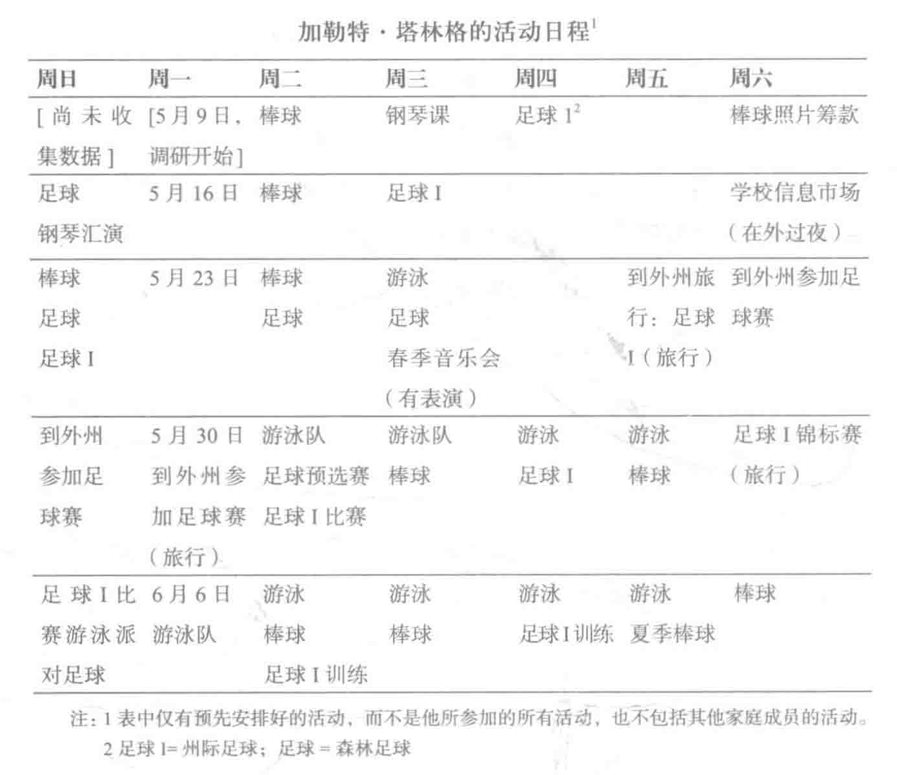

# 第三章 协作培养的忙碌节拍：加勒特·塔林格

> （五月的一个星期三，唐·塔林格从单位回来时，已经是大约晚上 10：00 了。）唐信步走到电话旁边，站在月历前，想看看上面写了些什么。当他发现第二天除了“玛丽”[调研人员] 之外再没有其他安排时，唐 [无声地] 紧握双拳把两臂放在胸前，做了一个举重运动员庆祝胜利的姿势。（他在摆出这个姿势的时候还微微一笑。）

有一个能得闲的晚上就让塔林格先生如此之高兴，可见他家里的时间安排有多么的忙乱。他的这种反映突出了协作培养把大人的空余时间控制到了何种程度。唐·塔林格和他太太路易丝都做全职工作，而且还要出公差。他们的三个孩子，加勒特（四年级）、斯宾塞（二年级）和萨姆（学龄前）都参加了各种各样的活动。平时的任何一个晚上或是周末的任意一天，都会有活动要参加，有时候是一个孩子有活动，有时候是两个孩子，有时候是三个孩子都有活动。而这些活动又常常是在不同的时间和这个城市的不同地点。这一家最优先考虑的事情就是有组织的体育活动。塔林格家的圣诞贺卡上，三个孩子的照片恰好捕捉到他们给了有组织的体育活动至关重要的地位。照片上是一个秋高气爽的日子，加勒特、斯宾塞和萨姆都穿着自己的足球制服——闪着光泽的蓝白相配的短裤和运动衫——每个孩子都把一只脚放在自己的足球上。他们都笑得很开怀。

这一章的焦点是中产阶级的塔林格一家如何安排他们的日常生活。这一家忙碌的日程安排并不是很特别的，我们发现这种中产阶级家庭日程安排的规律总是再三地重复出现，虽然其中也会有些许的变通，但是这一模式却是不变的。 [1] 塔林格家以及与他们家境相似的家庭都坚守着自己教养孩子的方法，即要把每个孩子都当做不同的个体来发展教育，这一教育法则有的时候就会让他们在全家同乐的时间上和整个家庭的需求上作出牺牲。中产阶级的家长通过鼓励孩子参加各种课外活动，在足球、棒球和钢琴课上，给予了孩子在学校教育中无法取得的东西。这些热衷体育运动的年轻人和崭露头角的音乐家们，得到了很多能帮助他们日后在公共机构界游刃有余的技巧和素质。他们学会了把自己看做是很特别的个体，有权利从大人那里得到某些服务。他们还得到了一套很宝贵的白领工作技能，包括如何按轻重缓急安排日程、如何安排旅行路线、如何与陌生人握手，以及如何在团队中运转劳作。然而，与此同时，他们也为此付出了代价。

同工人阶级和贫困家庭的孩子相比，我们所观察的这些中产阶级孩子对他们的兄弟姐妹都更倾向于竞争和敌对，而且他们和自己家族中的亲戚之间也没有那么紧密的联系。具有讽刺意味的是，孩子参加的活动越多，他们和自己家里人面对面互动的机会就越少。在塔林格家，除了一起吃饭以外（而这也只是一天一次），家长和孩子们都很少同时待在一个房间里。由于塔林格夫妇都工作，为了能把三个孩子送到不同的活动地点，他们需要分担运送孩子的责任。他们俩更有可能是每个人分别开车送一个（或两个）孩子去参加一项活动，而不是全家一起去观看某个孩子的训练或比赛。在活动进行的过程中，孩子们大都并不和父母在一起。他们都在足球场或篮球场上奔跑，而对塔林格家的孩子来说，他们之间的年龄差距更是加大了三兄弟间的距离。他们从来没有在同一个队里踢过球。

塔林格家的房子是一座 40 年前建造的白色二层小楼，有四间卧室和三个卫生间（译者按：和很多中国／亚洲人不同，很多中产阶级的美国人认为购买有一定历史背景的房子能体现出房主的品位）。房子坐落在东北部某主要城市的市郊，在一条死胡同的底部，环境十分幽静（译者按：美国人认为死胡同底部是最安全的，所以这个位置的房价也偏高）。周围的房子都保养得很好，其中很多座都价值 25 万美元。房子里有一扇面向街道的大型落地窗，窗外是一片宽阔的绿色草坪。前院中间有一棵大树，树的一根枝干上用白色的粗绳子吊着一个秋千。在通向车库的沥青车道附近有两根杆子，一根撑起一个篮球筐，另一根则支起一个饰有美国职业篮球联赛会标的小黑板。在这两根杆子的正后方，伸展着一张 2.1 米长的黑色细孔拦网，以防没有投准的球掉到邻居家的灌木丛里。一扇木门通向由篱笆隔开的很大的后院和游泳池。总而言之，这是一座很典型的市郊寓所。

房子里面有硬木的地板、贴了墙纸的房间和各种各样的宠物（一条名叫法利的狗、一只名叫伊凡的乌龟和各种颜色的金鱼）。客厅里铺有厚厚的地毯，上面放着一架小型钢琴，还有与钢琴颜色很搭配的家具（包括古香古色的桌子和一张凹背扶手靠椅）。但是，最热闹的地方应该要数厨房、私室（电视机的所在地）、或者鸟瞰后院和游泳池并用纱窗网罩住的晒台。房子会定时请专人来打扫，但是孩子们也会帮着整理床铺、喂宠物、把报纸和铁罐及瓶子都收好放在每周有人来取的资源回收桶里。塔林格先生掌管户外的事务，他每隔一段时间就会给人打电话来修剪草坪。他还掌管清洗游泳池及煤气烤架。当夫人出公差时，他就自己一个人管孩子，这也促使他比其他父亲更多参与对孩子的管理和教育。

塔林格夫妇喜欢体育运动，尤其是高尔夫球。他们是某精英私人乡间俱乐部的成员并经常去参加活动。他们两个人都 40 岁了，结婚有十二年。他们自称是“再婚者”，他们相识的时候，各自都曾结过婚又离了婚（当时各自都没有孩子）。塔林格女士整洁健康，留着时髦的金色短发。她给人一种平静沉着的感觉。

> 她经常穿得很时髦，就像那天从单位回来，[她] 穿着一件黑白间织的鱼鼓纹羊毛裙，刚好齐膝，上身穿着一件樱红色的短款羊毛夹克。她还穿着白色的长筒袜和黑色的高跟鞋。

塔林格先生高高的个子（刚刚过 1.8 米），宽宽的肩膀，头上略带红色的金发已经开始有些稀疏。他喜欢穿昂贵的西装去上班，周末的时候则喜欢穿高尔夫球衣和长款卡其布短裤。他喜欢说带着冷嘲又透着机敏的话，话里还略带几分反语的讥讽。比如说，当别人问他“最近好吗？”时，他常常会挂上一丝最轻浅的微笑答道：“极好无比。”

塔林格夫妇俩拥有同一所常春藤大学的学士学位，他们俩当时都曾积极参与体育运动。现在他们又都是公司的顾问（塔林格先生是做筹款的，塔林格女士是做人事的）。他们两个人每年的收入共有 17.5 万美元；直到调研快要结束时，他们还在同一家公司工作。他们夫妇都有足够多的弹性工时来应付孩子的学校活动，但是他们经常会在晚上和周末工作。在调研过程中，他们两个人都需要出公差。塔林格先生每周有三天要在公差途中度过，而且每次下班回来经常都已经是晚上 9：30 了。塔林格女士则尽量避免在外面干通宵。因此，她每月都有四、五天要很早就起床（早上 4：30）坐飞机到外州去，然后又要在晚饭后才能回来。他们安排最小的儿子参加了一个离家有五分钟的全托，两个稍微大点的儿子则参加课后辅导班。

塔林格家的三个儿子中，大儿子加勒特 10 岁，二儿子斯宾塞 7 岁，三儿子萨姆 4 岁。萨姆是一个看起来很结实的金发学前男孩。他一笑起来咯咯的，声音尖细。斯宾塞上二年级，是个开朗健谈的孩子。上四年级的加勒特是调研的“对象”，他又高又瘦，金色的头发，一脸严肃的表情。塔林格先生是这样描述自己的大儿子的：

> 他很害羞也很安静，你初次和他见面时觉得他不是很外向。但是他有特别强烈的取悦他人的欲望，所以他特别听话。然而他又十分好强。他喜欢赢，但是他又很好管。

和总是说个不停的斯宾塞不同，加勒特讲话多少是有选择性的。他能自己一声不响地玩球，也能在看电视时不对广告或节目作任何评论。但是，有的时候，尤其是家长不在他跟前的时候，他就活泼多了。他会编出一些用来解闷的小游戏。比如说，有一天晚上 8：00 左右，在一场棒球赛后，他一边等玉米面豆卷一边对着镜子向自己做鬼脸。他还好几次屏住呼吸，看自己能坚持多久。他的脸憋得通红，可是家里其他人却没有对此作出任何评论。

在观察和面谈中我们发现，加勒特既是一个成绩优异的好学生，又是一个出色的运动员。在一次家长会上，加勒特的老师说他“成绩和能力都不错，正好相当”。在人际互动方面，他泰然自若又成熟老到。与成年人会面时，他会直视着他们的眼睛和他们握手，而且通常都显得十分自如。作为一个运动员，他技艺精湛，就像这则现场记录所展现的他在州际精英队练足球时的表现：

> 这些小男孩现在分成了两队，他们开始混战起来。加勒特防守得很严，任何人都别想从他前面过去。冷静地攻击是他的球风。他看起来并不会去威胁或是去压倒其他队员，然而他的形象却映射出一种至高的控制力。

加勒特和他父母一样喜欢运动。他卧室的衣橱里塞满了各种奖杯，尤其是足球奖杯。他还有很多从球队交流活动中得来的足球袖章。在学校里，加勒特很受同学们的欢迎，大家都认为他是班里最棒的运动健将。课间休息的时候，他和其他的男孩子（有时候也有个别的女孩子）一起拿着足球冲到草地上，相互传踢，一直到课间休息结束为止。

加勒特的朋友们都是白人，他所接触到的其他人也都是白人，不管是在家里、在学校、或是在运动场上。来家里看小孩的十几岁的少年都是白人，定期来割草的工人也是白人。加勒特所在学校的两个四年级班里，有三名黑人学生和一名亚裔学生；该校全体学生中 90%都是白人。加勒特的钢琴教师是白人，参加钢琴汇演的所有孩子都是白人。他的游泳队里所有人都是白人。实际上，陪同塔林格一家去乡间俱乐部（练游泳）的调研人员在游泳池边上只看到了白人孩子、白人家长和白人俱乐部职员（除了一名黑人游泳教练）。加勒特的全白人游泳队有时候会和有黑人孩子的队进行比赛。

## 组织日常生活：发展加勒特的能力

在塔林格一家人中，大儿子的日程安排决定了全家的步调。塔林格夫妇常常只有很有限的时间奔波于工作和孩子的活动之间。他们匆匆忙忙赶回家，风风火火地察看一遍信件，准备餐点，换下工作时穿的套装，确保孩子穿好符合活动要求的着装并带齐用具，找到车钥匙，把狗放到外面，把孩子和活动器具装到车里，锁上门，然后匆匆开走。除了一些小的变动之外，这一生活模式日复一日周而复始。加勒特的活动最多。因此，他的活动也就决定了家长什么时候必须要在什么地点，同时也决定了包括萨姆在内的每个人什么时候吃什么样的饭，甚至决定了一家人如何制定度假计划。

就像表 2（见下页）中加勒特五月份的活动安排所示，加勒特要参加棒球、森林足球队（一个私人足球俱乐部）、州际足球（一个明星精英队，由从各个足球俱乐部挑选出的男孩子组成）、游泳队的训练、钢琴课和萨克斯管练习。只有萨克斯管课在学校进行，其他所有活动都是校外活动，加勒特的父母需要在他同意后帮他报名。表中并未包括斯宾塞的活动，也未反映出家长自己的事务。5 月 23 日的这一周，当加勒特有他一贯参加的棒球、足球和游泳队活动时，塔林格先生自己还在周一晚上会为一场比赛作裁判，而且斯宾塞在周二也有棒球赛、还有周四的俱乐部童子军会。周末的时候，全家开车四个小时去参加一场外州的足球比赛。他们要出去三整天：周五、周六和周日，然后在周一早上才能回来。加勒特周二有游泳队的训练、足球预选赛，还有州际足球训练。周三有游泳队训练（他能自己骑自行车去），还有棒球比赛。周四，在加勒特有游泳训练和森林足

球的同时，斯宾塞下午 5：45 有棒球比赛。而后，周六的时候斯宾塞还有一场棒球比赛（在早上 9：15），加勒特有两场足球比赛，一场在早上 10：15，另一场在下午 3：00。当然了，并不是所有的中产阶级家庭都只围着体育活动打转——也不是所有的中产阶级家庭都像塔林格家这样忙碌。尽管如此，本项调研中的很多中产阶级孩子都有同样忙乱繁多的活动。中产阶级孩子还比工人阶级及贫困家庭的孩子有更多的活动（见表 C4，附录三）。参加活动的种类有一定的性别差异，男孩子比女孩子有更多的体育活动（见表 C5、C6，附录三）。

塔林格夫妇在五月份都要到外州出差。在 5 月 9 日的这个星期里，塔林格先生被安排到西海岸去办事，乘早班飞机回来。他的飞机定在周三的午夜，周四早上到家，睡上几个小时，然后还要去上班。当晚，他带加勒特去参加足球训练。5 月 23 日这周，塔林格女士周二在外面过夜，周三晚上 10：00 前一点点才到家。第二天是 5 月 26 日，塔林格女士要赶早上 6：30 的飞机到外州去，晚上 8：00 回到家里。后面的一个星期塔林格女士还要如此，周三出差，周四很晚才到家，第二天又要到外州去。

光是这些活动的数量就足以增加各个活动之间发生撞车和时间冲突的几率。因此，所有的活动——包括萨姆要外出——都必须事先预定：

> 路易丝取回信件。她站在门廊上喊着：“萨姆，这个是你的！”她打开信封，萨姆急忙跑到她身边。她把卡片（一张生日派对的邀请卡）交给萨姆，萨姆看到邀请卡正面那个像恐龙的动物，高兴地笑了。

4 岁的萨姆已经知道家里的行事历有多么重要了。他知道如果他的两个哥哥有活动，那他就有可能无法接受这个生日派对的邀请了：

> [路易丝] 说：“我知道我们 11 号得去一个什么地方。如果我们早上在家，你就能去这个派对。”……路易丝走到行事历前，翻到六月份，看了一下。萨姆脸上略带着一丝忧虑，充满期待地问：“我能去吗？”路易丝说：“你运气不错啊，我们那天早上在家。”

可是，其实从某种意义上说，萨姆比他的两个哥哥有更多的自治权，萨姆的生活更少被提前定好的不连贯的活动所占据。加勒特和斯宾塞都没有较长的一段时间可以归自己组织定义。预定好的活动在他们生活中占有如此中心的地位，以至于他们用自己参加的活动来确定那一天是星期几（包括晚上的时间）。加勒特和斯宾塞还把（像足球、训练、游泳和钢琴这样的活动）时间分成活动前、活动中或活动后。而且，和我们观察的其他中产阶级孩子一样，他们两个还有相当长的时间仅仅是在等待下一个活动的到来。他们所参加的大多数活动——包括上学——都需要由大人来车接车送，其中大部分活动的起止时间也都是由大人安排的。像加勒特参加的棒球赛等体育活动都是由成年人组织安排的，像我们看到的工人阶级和穷人孩子玩的那种由左邻右舍的孩子们自发形成的垒球或棒球游戏在加勒特的生活中极其少见，甚至根本就不存在。

当然了，也不是每一天的每一分钟都是由成年人决定的。塔林格家的孩子有时也会乘校车回家，给自己找点零食，然后在父母回家前看上半小时电视，所有这些都不是在家长看护下做的。加勒特、斯宾塞和萨姆也会在外面自由玩耍。在预先安排好的活动之前和之后的时间里，他们三个经常在院子里（用一个网球拍）玩棒球，或者骑自行车。有时候，他们的父母也会到后院加入他们的游戏中。但是，塔林格家的孩子却不会像穷人家的孩子那样整天在外面玩。塔林格一家的左邻右舍本就没有多少小孩子，而且也没有与这些男孩年龄相仿的其他男孩子。有时候，也会有小朋友骑车来找他们玩，但是，想互相找着玩的孩子通常都会由父母开车送到“玩伴约会”的地点。

塔林格一家既喜欢运动类的游戏又喜欢言语机智的问答游戏（类似脑筋急转弯）。有一天晚上吃饭前，孩子们就玩起了猜谜语，还把调研人员也弄了进来。

> 斯宾塞一边笑着一边缠着我，和我猜了一连串的谜语。他先问我：“玛丽，如果一只公鸡在鸡篷的顶上下了一个蛋，你说，这个蛋会从哪边掉下来？”我笑着想了一下，然后用一种假装怀疑的口气说：“嗯，让我想想，我觉得公鸡不会下蛋啊。”

一家人还会边吃饭边讲笑话。一次斯宾塞提醒他妈妈在参观美术馆的回执表上签字。加勒特为了显示自己有知识，考验了一下斯宾塞到底对凡·高了解多少。而这又给了塔林格先生一个灵感，来插入他自己的机智应答：

> 加勒特考斯宾塞说：“你知道凡·高做了什么（不一般的）事情吗？”斯宾塞说：“我知道，他把自己的耳朵割了下来，还把它寄给了一个朋友。”唐低声地咯咯笑了几下，说：“所以你可以说，他传送了‘耳听邮件’！”每个人都被他的双关语逗笑了。（译者按：“耳听电邮”是一种苹果电脑专用的用手机查电邮的共享软件，使用苹果电脑而不是微软公司的电脑是欧美有钱人的特点。）

塔林格女士也喜欢和孩子们玩，正如下面这个实例中所表现出来的：

> 加勒特在自己的卧室里和妈妈站得很近，互相对视着，胡乱搞笑。他双眼直视着她，然后举起双手，和他妈妈掌心相对。路易丝很配合地陪他玩，没有推开他。他们玩了三次，一边玩一边笑。

这个游戏进而演变成了一个“坚持瞪眼”的游戏：

> [加勒特] 说：“瞪着我。坚持瞪下去？看谁先眨眼？”她说：“好吧。”他们站在那里，双手相对，使劲儿瞪着对方。路易丝先眨了眼并把目光移开了；他们俩都笑了。他说：“还想玩吗？”她就又和他玩。他们大约相持对视了十五秒钟，然后她又把目光移开了。他安静地笑了，但是很开心很满足，她也笑了。

恬静的时光也是会出现的。比如一个早晨，加勒特还很困没有完全醒来，他在通往父母卧室的走廊上用胳膊环抱着他爸爸，紧贴着他站着。身着蓝白双色浴衣的塔林格先生也把胳膊搭在儿子的肩膀上。他们俩就这样安宁地相拥着在那里站了一会儿。

然而，一家人之间自由玩耍和恬静的瞬间通常都是很有限很次要的。有组织的活动仍然是塔林格家孩子生活的中心。这些活动深入到了家庭生活的核心。钢琴、足球、棒球和篮球成了家庭成员谈话的焦点，孩子们和父母、和前来做客的成年人以及亲友都会谈论这些话题。对于像加勒特这样天性并不健谈的孩子来说，与有组织的活动相关的交流可能会很简短。比如说，州际足球队的第一次训练之后，塔林格先生和加勒特在回家途中在车里“讨论”了有关新赛季的情况：

- 唐：那个，莫尼教练怎么样？好吗？
- 加勒特：挺好的。
- 唐：他和你们谈过（球技）吗？还是他只是给你们操练？
- 加勒特：只是操练。
- 唐：他说过有关决定位置的事情吗？
- 加勒特：没有。

除了塔林格先生问的那个没有团队精神的“贪功小猪”是谁之外，这次在回家路上的交流总共十五分钟，全都是由典型的父子一问一答组成的。

加勒特能够和他的父母以热诚亲密的方式交流，但是这样的对话并不经常出现。更多的都是像上面描述的和塔林格先生之间的对话那样，或是像下面描述的和塔林格女士的对话那样。这里请注意，虽然加勒特和妈妈之间的感情联系显然很好，但是他们所谈论的话题却是和加勒特参加的活动有关。

（路易丝坐在加勒特的床边，她把手放在他的胸前。那天晚上斯宾塞为了给调研人员腾出一间卧室，就来他哥哥的房间里过夜。屋里熄了灯，很黑，只有走廊里的灯光隐隐照进来。路易丝和加勒特正在讨论当晚早些时候加勒特在春季音乐会上表演的歌曲。）

- 妈妈：啊，你知道吗？我把“从远方”（From a Distance）和你今晚唱的“从我的角度”（From Where I Stand）给弄混了。我以为你唱的是贝特·米德勒（Better Midler）的“从远方”呢。
- 加勒特：“从远方”是怎么唱的？
- 妈妈（开始唱）：从远方——（忽然停下来，笑了一笑，又开始唱然后又停了下来，记不起来了）——我记不起来了。你知道你妈记性不好！
- 斯宾塞（取笑地）：从远方，太遥远了，我记不起来歌词了。
- 妈妈：这歌儿很好听的呢。

他们随意聊了一会哪些老师参加了音乐会，哪些老师没参加，然后便互道晚安。

## 协作培养：为爱孩子而加倍付出的努力

孩子们参加的各种活动给父母带来了十分繁重的工作。家长为孩子们填报名表、开支票、安排与其他家庭合用汽车接送孩子、洗制服、开车送孩子去参加活动，还要做点心和饮料给孩子们吃喝。在塔林格家，这些任务都依哪个孩子要做什么而定，常常总是双倍的。单是帮助孩子准备好去参加活动——拿好所有的器具、把孩子组织好、往车上装东西——就够令人疲惫的。

对于成年人来说，除了要花力气准备之外，还要花力气看孩子们的活动。五月的一天，塔林格先生头天半夜才出差回来，眼睛熬得红红的，转天的早上一直在工作，下午才眯了两小时觉。当晚天寒料峭，他又带孩子去练足球了。在训练中，塔林格先生起身出去不看了。他解释说，要到旁边的小卖部去买一杯咖啡：

> 晚上 7：05 的时候，唐说他要去买杯咖啡喝。他问汤姆（另一个孩子的父亲）是否要他给捎一杯。汤姆摇了摇头。唐问我想不想要。我问他能不能让我和他一起去（主要是因为我太冷了）。在去小卖部的路上，唐说：“我并不是真的想喝咖啡。我只是觉得太没劲了。以前他的每次训练每次比赛我都去看，但是现在他参加得太多了，我也并不是每次都全看下去。可是这是他的第一次训练。”

塔林格先生特别渴望训练早点结束：

> 我们回来的时候，孩子们正在休息。唐说：“结束了？我们不会这么幸运吧？”

孩子们参加的众多活动能让家长的耐心及时间都丧失殆尽。例如，在暑假刚刚开始的一个六月的下午，塔林格先生下班回来，要带加勒特去参加足球比赛。加勒特还没有准备好，而他那种懒洋洋不想好好准备的样子也让他爸爸很是心烦：

> 唐说：“把你的东西准备好——你得去参加足球比赛了！”加勒特穿着白色的短护腿和长长的绿色球衣进入私室里，他是 16 号。他坐在和电视机斜对角的扶手椅上，慵懒无力地看着世界杯。他慢慢地心不在焉地穿上护胫，再穿上长袜。他的眼睛紧紧地盯着电视屏幕。唐走了进来：“快去拿你的其他东西。”加勒特说他找不到短裤了。唐说：“你是不是放在抽屉里了？”加勒特点了点头……他起身去找短裤，几分钟后却又回到了私室。我问他：“找到了吗？”加勒特摇摇头。唐在家里的其他地方翻找着，然后又走了进来，对加勒特说：“哎，加勒特，你是不是也该穿上鞋子了呢？”（唐离开了一下又很快回来了）：“加勒特，我们必须得走了！我们迟到了！”他的口气简短而唐突。接着他走了进来看到加勒特正坐在那里，就一言不发地把那条绿色光面短裤抛到了他的大腿上。

类似这种忙乱翻找一条绿色光面短裤的事情在塔林格家是很常见的。最典型的解决办法就是家长最终找到了不见的东西，同时还要催促孩子加快动作。比起今天狂乱的时间安排来，明天的日程压力只高不低，这一点同样是事实：

> 唐（描述他们星期六的安排）：明天真会忙疯的。我们有一场足球比赛，然后有一场棒球比赛，然后还有一场足球比赛。

每隔几天，塔林格一家的活动日程就会出现冲突，这样一来也就更是加重了他们为协作培养而不懈努力所付出的辛苦，比如，加勒特一人参加了好几个足球队——“最好”的巡游赛队即私人森林足球俱乐部，镇区足球队，以及州际足球队。5 月 22 日星期天，加勒特和他在足球队里的一个小朋友坐在车里等着家长送他们到州际足球队参加第一次训练。塔林特先生和小朋友的爸爸（比尔）则在讨论一次近在咫尺的时间冲突：

> 唐又说：“我发现足球训练和预选之间有冲突。”比尔说：“州际的那个看起来更紧迫，因为他们还没有太多的机会一起合作过。”唐说：“是呀，可是如果不去参加预选的话，就不能加入那个队了。”比尔说：“可不是嘛。我得 [和预选的教练] 谈谈这事。”他停顿了一下，转身走下台阶，然后又回过头说：“也许（戏谑地眨了一下眼）我们能被特免呢。”他哈哈笑了起来，唐也笑了。

有时候，塔林格夫妇通过调整自己的工作时间表来解决潜在的时间冲突。但是，他们显然很不情愿进行这样的调整，正像塔林格先生所说：“足球总是有种傲慢的感觉。我是说，他们就认定你会有时间，你能随时放下工作，把孩子拖到球场上去比赛。可是如果你的工作是计工时的，那怎么办呢？”另一些时候，加勒特为了参加一个活动就必须放弃另一个。比如说，学校音乐会的那天晚上，他只去参加了游泳训练，而没有能够参加足球比赛。父亲节的那天，加勒特不能到乡村俱乐部去参加父子特别高尔夫联赛，因为——他解释说——那天“我有两场足球比赛和一场棒球赛”。斯宾塞倒是参加了父子高尔父球赛。所以，就连像父亲节这样特别的日子，一家人也要分头行动。

在像塔林格这样的家庭里，知道活动之间的冲突是不可避免的，并不能减少这些冲突给他们带来的紧张和受挫感。最后一刻的变动有时会使全家日程的综合结构功亏一篑，无论这些变动是和孩子的活动时间有关，还是和学期起始日期的调整有关，或是和塔林格夫妇各自（或二人）仓促既定的工作会议有关。比如，5 月 18 日星期三这天，加勒特得到通知说，州际足球比赛定在了即将到来的这个星期天。当时父母都不在家，一个高中生正在他家看着他们。塔林格先生下班回到家中已是晚上 9：30，塔林格女士十分钟后才到家，并开始准备送看孩子的高中生回家。当时他们都站在厨房里，塔林格先生把足球赛的时间告诉了他夫人：

> 唐对路易丝说：“他 22 号有场比赛。“他把足球时间表拿给她看。路易丝说：“这个可没有写在我们的日程安排上。”唐听起来一副很烦的样子，说：“我知道，球赛时间变了。”路易丝走到厨房的综合时间表前，那个综合时间表就挂在电话旁边的墙上。她说：“新时间是在几点？”唐没有再去看那张纸，只是应了一句：“4：00。”路易丝说：“那他可以去。”我从来没有听到唐如此沮丧烦闷过，他对看孩子的高中生说：“他在同一天有两场足球赛，一场棒球赛，还有一个毕业派对。”路易丝（看着活动地点）说：“离得都太远了啊。”

像这样的时间冲突加剧了家长所承担的“无形的劳作”，他们要照顾孩子的饮食，收拾房间，还要协调时间表上各种不同事务的最后期限。随着职业女性人数的不断增长，家长尤其是母亲身上的强大压力也日趋增加。阿利·霍克希尔德（Arlie Hochschild）已经将这一现象用术语“第二轮班”（the second shift）来表示。她和其他学者还指出，虽然现在男性为家庭和子女所做的贡献有所增加，但是他们仍然把自己的力量集中在户外劳作上（例如，割草、刷漆或是修房子）。塔林格先生是一位很有参与精神的父亲，他经常和孩子们在外面玩球。但是，和很多家庭一样，当塔林格女士在家的时候，她在做饭、穿衣和协调孩子生活等方面都起着主导作用。塔林格先生只是她的帮手。

另一方面，女性在家里做的事情仍然是在室内而且主要是有时间期限的（例如，做饭、帮孩子准备好到幼儿园或学校去、哄孩子上床睡觉）。虽然研究人员已经记载了“无形家庭劳作”的很多方面，但是现有的论文并没有去调查孩子的活动是如何影响那些做“第二轮班”的家长的。和孩子的饮食起居不同，孩子参加的有组织的活动通常有严格的起始时间。家长们得按时去接送孩子。这些规定都是为了孩子的安全着想，家长也都会尽量遵守。我们一次又一次地观察到，活动刚一结束，家长们在一两分钟之内就都到了。定期在规定的时间内完成所有这些随意制定的最后期限，让人在感情上和身体上都可能会吃不消。

塔林格夫妇对家庭生活步调的处理方式不尽相同。比如说，有天下午 5：40 的时候，塔林格先生从外面匆忙地开进了车道。他从车上跳下来，从身上搜出钥匙，他打开房子的前门，然后几乎马上就严厉地告诉孩子们他们应该去做作业。塔林格女士 6：00 左右到家，她看起来比她丈夫要放松得多。即使她的压力显然很大，在孩子们向她提出很多问题或是在看到最终期限降临的时候，塔林格女士和孩子们独处的时候也不像塔林格先生那样紧张。

而且，家庭生活中的压力在塔林格夫妇身上并不是平均分担的。虽然塔林格先生很积极地参与孩子的生活，但是他每周都要出两到三天的公差。塔林格女士做全职的时候，她也还是要在家务方面承担更主导的角色，像看管孩子、给孩子做饭、帮孩子打理日常事务等工作她都要做。尽管如此，塔林格先生仍然是一位不可多得的好父亲，他会在塔林格女士出差的时候积极地承担起照顾孩子的责任。

当家庭利益面临冲突时，也是塔林格女士在自己的事业上作出调整。在调研快要结束的时候，塔林格女士决定辞职。她要在离家近的地方找份工作，这样她就可以为了孩子经常在家“坚守阵地”了。最终她选择了做一家极少有出差要求的非营利性机构的高级管理人员。她把这个决定描述成“把我的事业暂时搁置起来”。

虽然如此，在家务的某些方面，塔林格先生比起其他中产阶级的父亲为家里作的贡献来还是要多得多。当他夫人早上开会或是出差的时候，他总会很胜任地把孩子打理好送上学校。有天早上塔林格女士很早就要去上班，他就留在了家里送孩子上学并参加了“和爸爸一起吃多纳圈”的活动，而这个多纳圈活动就是由家教联会组织的。现在孩子们正在地下室玩呢。他们把枕垫塞在衣服里，让自己看上去更像冰球的守门员：

> 突然，[唐] 从楼上半带愤怒地往楼下喊了一嗓子，“斯宾塞——你喂伊凡和法利了吗？加勒特，你喂鱼了吗？”斯宾塞说：“我喂伊凡了。”两个孩子都快速地向楼梯跑去，他们上楼的时候胸前还塞着枕垫。他们正往上走的时候，[唐] 往下喊道：“给法利喂点食。还有加勒特——喂鱼。”我跟着他们上了楼。加勒特到私室去喂鱼了。

喂好鱼后，加勒特走进了厨房（那个鼓鼓的枕垫还塞在他的衣服里），站在桌子旁边。他爸爸在整理文件，全新的音响系统正在大声地播放着。塔林格先生（并不理会那个塞在儿子胸前的枕垫）开始很严肃地提醒加勒特：

> [唐] 说：“你要坐校车去上学，对吧？”加勒特说：“是呀。”“……校车什么时候来？……你有家门钥匙吗？”加勒特一边点头一边检查书包，看自已有没有带钥匙。[唐] 点点头，说：“别误了车。”

在这一次互动中，塔林格先生在设法提醒孩子们完成各种任务时看上去很匆忙也很不耐烦。萨姆和斯宾塞一边在前门等爸爸开车带他们去学校，一边抱怨个没完没了。他们的爸爸穿过走廊，停下来斥责萨姆。他命令道：“萨姆！住口！”

在我们所观察的其他家庭中，在照顾孩子方面，那些父亲们都没有塔林格先生这样在行，也没有他这么高的参与程度。但是，就连他自己也不认为他在家里照顾孩子有他在单位的工作那么繁重。当父母二人都在家的时候，大多数家务就都由塔林格女士承担了。钢琴汇演那天，是她找到并熨好了孩子们的裤子，是她安排好了汇演所需的小吃（草莓和栗子松饼）。是她给孩子们的老师买了圣诞及年末礼物，又是她给老师们写了贺词，感谢老师们在一年当中所付出的努力。重要的是，这种性别分工的模式符合孩子和学校教职人员的期望：学校要求母亲而不是父亲在回执许可上签字并帮助孩子完成日常生活中的各种事务。

## 一个受到悉心培养的童年：加勒特的视角

加勒特并不是一个特别外露的孩子，但是显然他很喜欢自己参加的各种活动，尤其是和体育运动有关的活动。他认为，没有这些活动，他的生活将会很“没劲”。和下一章中的工人阶级男孩泰雷克·泰勒不同，加勒特不会为要去训练或比赛而抱怨。如果他不得不错过一场比赛的话，他看起来显得十分失望。在一次面谈中，加勒特汇报说，他尤其喜欢竞技比赛。比如，像篮球，他说他喜欢“防守……把其他球员推来撞去”。森林足球巡游队和州际足球队在他心里排名很高，因为这两个队的队员技术好，“球场更大，得分更高”。相比之下，体育课的足球“踢一会儿就变得很没劲了”。当调研人员问他是否会感到很累的时候，加勒特承认说，当他一天里有两场足球赛和一场篮球赛还有三个其他活动的时候，的确会“很累”，但是跟着他就说道：“其实也并不是很多啦。”接着他想了一下，又改口道：“对我来说并不算什么，但是对我爸来说可能就比较累了，[因为] 他得带我到处跑，还得在大热天里看我比赛……他得接我又得送我。”

对于不同寻常的足球活动，像到外州去参加联赛，加勒特总是热切地期待着。在周末旅行前的那个星期三晚上，他上床钻进被子里，他的妈妈正和他道晚安，加勒特兴奋地说：“还有两天我们就走了！”同样的，加勒特在得到那套装饰着“精选”字样的州际足球队球衣时也十分兴奋。训练结束后，他和爸爸一坐到车里，他就马上开始研究起自己的新球衣。

> 唐和加勒特系上了安全带。加勒特马上打开口袋看里面的东西。他把一件上面印有“精选”字样的绿色尼龙球衣拿了出来。加勒特说：“我想我会穿这件（去比赛）的。”唐说：“这就是比赛时候穿的。“加勒特看起来特别喜欢这件夹克。然后他又往袋子（一个棕色的纸袋子）里面看了看，说里面还有两件短裤、一条裤子（其实是一条亮绿色的短裤）和两双袜子。加勒特大声地列举着袋子里的每一样物品，听起来特别兴奋。

一回到家，他就马上把这套球衣给妈妈和兄弟们看。像这样明显地表达他对所参加活动的喜爱与热衷是真诚的，但对加勒特来说又是有选择性的。比如说，虽然加勒特进入了明星棒球队，但他却说：“我并不 [像] 发现自己入选了州际和森林巡回赛队那么兴奋。”但是他又解释说：“棒球就像是我的第四种运动”，排在两个足球队和篮球之后。加勒特参加的活动太多了，所以每个活动本身反而显得不怎么重要。例如，他在学校的春季音乐会上表演萨克斯管三重奏，但是这个活动对他来讲却了无趣味。而在我们所观察的工人阶级家庭中，像音乐会这样的学校活动能让他们谈论好久又好不期待。同样的，工人阶级和贫困家庭的孩子认为值得兴奋的事情——像吃比萨饼、面包店烤的面包、或是和大家族中的亲戚开派对——对加勒特来说都没有吸引力。

有的时候，加勒特也会很疲累很烦躁：

> 加勒特心情不好……布赖恩的爸爸晚上 8：20 开车把他送回家。他进了家门，却没有和任何人打招呼。我评论他新理的头发时，他也没有说什么。他看起来很安静，很疏远。整个晚上他基本上什么都没说。唐晚上 9：30 到家。唐进屋 [对看孩子的人] 说：“嗨，弗兰基。很高兴见到你。”弗兰基站起身来和唐握手。唐然后说：“嗨，加勒特。”加勒特没有回答。唐说：“嗨，加勒特。”加勒特看了唐一眼说：“嗨。”唐问：“加勒特，你还好吗？”加勒特回答道：“还行。”唐转身进了厨房。

我们观察到其他中产阶级的孩子也有同样疲累的时候。亚历山大·威廉斯，一个中产阶级黑人男孩，也在从课后辅导班到周五晚间唱诗班的路上显得很疲倦；一个星期六的下午，一个名叫斯泰西·马歇尔的中产阶级黑人女孩在电吹风的下面睡着了。而在工人阶级和贫困家庭的孩子中，我们却没有看到类似的现象。如果有什么区别的话，就是大人们评论说这些小孩子有着无穷无尽的能量。

## 一个受到悉心培养的童年：斯宾塞和萨姆的视角

中产阶级的家庭生活是以每一个孩子的活动为中心而组织起来的，这种组织生活的方式塑造了所有家庭成员的经历，包括并没有参与某项具体活动的兄弟姐妹的安排。斯宾塞和萨姆——尤其是萨姆——要花很长的空闲时间辗转在去加勒特的活动的路上，还要在一旁看着这些活动（或者只是在那里等着活动结束）。萨姆的很多个下午都是跟着他两个哥哥的日程安排团团转。他从幼儿园回到家里待上一小会儿，就要坐车由家长带着去看加勒特的某一个活动。一旦到了活动现场，他通常会到处闲逛，向大人要零食，然后等着比赛或者训练结束。不足为奇，在活动还远远没有结束的时候，他的兴趣和耐心就都已被消磨殆尽。萨姆每周抱怨哭闹四五次是常有的事（这种行为在他饿了或是累了时会变得更加突出）。

然而，就像他妈妈所说的那样，有时候他的烦躁会升级到一种让他“崩溃”的程度。他会大声嚎哭而且经常打断别人，如果他不喜欢周围发生的事情，他有时候还会乱蹬乱踢，又哭又叫。比如，加勒特参加学校音乐会的那天晚上，萨姆才过了半个小时就坐不住了。一开始他通过拒绝安静地坐着来考验他妈妈的耐心；然后他又伸长双腿把脚放在前排椅子的靠背上，差点就踢到前面的人：

> 他妈妈一把抓住他胳膊的前段（看起来很生气）说：“注意你的脚——你差点儿没踢到她！坐好了！”他坐了几秒钟然后又开始动脚。她又抓住了他的胳膊低声说：“坐好！”

每个月萨姆都要“崩溃”几次。塔林格先生会采取比较直接的方法，告诉萨姆“住口”。塔林格女士则通常会对萨姆的爆发采取温和忍让的态度，她还鼓励萨姆的哥哥们多从萨姆的角度感受一下（但其成功率却是有限的）。

萨姆才 4 岁，所以除了幼儿园之外他没有太多其他活动。而斯宾塞则有一个包括钢琴、幼童军和棒球在内的活动日程。尽管如此，他也还是要花更多的时间去作一个不情愿的观众。斯宾塞不像萨姆那样，他不会“崩溃”，但是他的确会与父母交流自己的无奈。例如，他爸爸知道“他确实为我们都必须去看加勒特的比赛而感到恼火”。实际上，看加勒特参加活动是斯宾塞生活的主要部分。在学校组织的和爸爸一起吃多纳圈的活动中，斯宾塞领着他父亲到自己的画前看他画了些什么。斯宾塞在讲解自己的画时告诉父亲说，画里有一些孩子在操场上训练，站在一旁观看的就是他和他的家人。这幅画的题目叫做“观看足球”。塔林格先生亲切地用手抚摸着儿子的头，评论说：“我们的确老是在看足球。”

与观看相对的，当然就是踢球了。在这方面，斯宾塞还是得适应加勒特定下的标准。虽然斯宾塞也参加棒球和足球，但与他哥哥相比，他看起来对体育并不是那么感兴趣——也没有那么有天赋。从他父母的角度来看，这个就很成问题。有好几次，塔林格夫妇都（分别）提到过他们为斯宾塞对体育运动不怎么感兴趣而担心。

- 唐：我们和斯宾塞没少费劲，因为他不喜欢运动。我们觉得他在这方面特别一般。路易丝和我都这么想。但是然后我们又问自己：“我们能做点什么？”我主张到外面去玩传球。我通常不会想到外面收集蜘蛛或是做斯宾塞喜欢的那些事情。他喜欢自然科学。我一般不会去想那些东西。
- 调研人员：这可不容易。
- 唐：我们在体育运动方面很有天赋。
- 调研人员：斯宾塞会和加勒特竞争吗？
- 唐：他知道他竞争不过他哥哥。加勒特要强得多。

斯宾塞好像自己也知道他父母为他没有加勒特那样喜欢运动而担心，正如下面这段笔记所示：

> 唐（好像刚刚想到这点似的）以一种疑问（但是又很热情）的语气对斯宾塞说：“斯宾塞，你想加入游泳队吗？”斯宾塞看起来有点儿紧张，咬了一下嘴唇，回答说：“不想。”小作停顿之后他爸爸带着一种接纳的口吻说：“好吧。”（话里也带着一丝失望。）斯宾塞 [到厨房] 去找书包，他爸爸又站到了他身边。斯宾塞说：“我也想啊——可是我不知道怎么划水。”他爸爸说：“那就是他们要教你的啊，他们会教你怎么划水。”

父子之间的整个互动过程只有不到一分钟的时间，但至少对斯宾塞来说，这是很紧张的一分钟。

## 兄弟姐妹之间的竞争和冲突

斯宾塞在体育方面稍见逊色，这也影响到他和加勒特之间的关系。有时候他会故意去找他哥哥不擅长的东西。比如，一天下午，加勒特和一位调研人员正在车道上玩投篮，斯宾塞评论说：

> “加勒特篮球打得不怎么好。真的不怎么好。”加勒特很快反驳斯宾塞说：“噢，是嘛？我比你打得好。”斯宾塞不理睬加勒特，他看上去并没有被加勒特的话吓倒。斯宾塞继续说：“我是说，他并不擅长篮球。他不是最好的篮球手。”加勒特看起来好像是被斯宾塞的话给惹恼了，他镇定地自卫说：“噢，是嘛？因为我打得不好所以才有 [X 个] 反弹球，所以才比体育课上任何人都多。”斯宾塞实事求是地声明说：“我是说篮球并不是你最擅长的项目。”

斯宾塞还会定期炫耀自己作为天才班学生的身份。加勒特虽然已经试考过两次了，但他还是没有到达智商为 125 的分数线（他得了 119 分）。当斯宾塞考入天才班的时候，加勒特特别伤心，泪流满面。对加勒特来说，他也会抓住机会突出自己高超的技能。比如，在一次钢琴课上，他故意弹起了斯宾塞将要在汇演中弹奏的曲子，而且他知道自己比弟弟弹得好，也知道斯宾塞能听到他在弹：

> 加勒特：我能弹…… 钢琴老师：别弹了。（加勒特继续弹。）别弹这首曲子。他弹不了这么快，你别给他捣乱了。（加勒特继续弹着，还咧着嘴笑着。）你把他的方寸都搅乱了。（加勒特还在弹着。）我不想让你再弹了。（加勒特这才停下来。）

虽然兄弟两个之间存在着这样的竞争，但是斯宾塞和加勒特之间的关系经常还是很友好的。加勒特也会帮忙的：

> 加勒特拿出一个练习本，低头看着上面的一道数学题……斯宾塞说：“加勒特，我不明白这道题该怎么做。”加特勒轻声说：“来，我来帮你看看。”这是一道加法题。加勒特说：“75 加 99 等于多少？”斯宾塞翻了一下眼睛说；“我不知道。我没有办法心算！”他听起来被加勒特问烦了。好像他简直不能相信加勒特居然还会这样问他。加勒特把作业纸放在桌子的一角，好让斯宾塞能够看到，他慢慢地说：“没关系，9 加 5 是多少？”斯宾塞说：“9 加 5……嗯，是 14，我能算出这个。”加勒特把这个数写了下来，说：“然后你在这里进位，”然后他指了指进位的那个数。他又接着说：“现在 1 加 7 加 9 是多少？”斯宾塞停了一下说：“17。”加勒特把数字写了下来。唐在加勒特把作业纸还给斯宾塞的时候大步走过厨房。唐充满怀疑地问：“你们俩干吗呢？”加勒特镇静地说：“我给他讲了一道题。”

但是，斯宾塞却不能和萨姆处好关系。他们俩经常吵架，有时还会吵得很凶。

> 斯宾塞忽然在客厅里大叫起来，“停！停！躲我远点！”萨姆开始大哭。我听见楼上一声沉重的摔门声，然后路易丝大声跺着脚走下楼来。她走进客厅命令说：“到底怎么了？说啊！”斯宾塞解释说：“他总是跟着我！”路易丝越听越烦，说：“他跟着你又怎么了！”她还用责备的口气说：“你像萨姆这么大的时候也总跟着加勒特！你这样对待萨姆，一点道理都没有。没有道理。”

孩子之间发生这样的口角是常有的事，也经常需要第三方出面才能解决。父母中会有一个站出来干涉，并转移开一个或两个孩子的注意力。

塔林格家的孩子和很多中产阶级的同龄人一样，会坦诚地表达他们对自己兄弟姐妹的看法。说“恨”家里的某个人是很常见的，而且听到的人也不会作出什么特殊的反应。比如说，有天傍晚斯宾塞和萨姆跟着来看护他们的弗兰基（还有一位调研人员）在前院玩垒球时，

> 斯宾塞问萨姆他最恨谁。萨姆说是加勒特。斯宾塞让萨姆假装自己在 [用球棒] 打加勒特的脑袋。弗兰基说：“萨姆，你可是告诉过我你最恨斯宾塞的。”斯宾塞重复说：“假装它（球）就是加勒特的脑袋。”

这种我们所看到的中产阶级孩子在兄弟姐妹之间公开表现出的敌对行为，在工人阶级和贫困家庭的孩子中却并末出现。工人阶级家庭的孩子之间明显有相互讨厌对方的时候，但是我们却从未听到过中产阶级孩子这种毫不掩饰甚至是随随便便就提到憎恨的话。同样的，中产阶级孩子之间的大声吵闹及需要大人出面才能解决冲突这一现象，在工人阶级和贫困家庭中也是很少见的。对于后者来说，兄弟姐妹之间的冲突既没有这么吵吵闹闹，也不大会在大人在场的时候发生。

## 亲戚的重要性相对较小

塔林格家的社交生活都是围绕着孩子的活动，而不是围绕着和大家庭保持联系来安排的。这种弱化了的亲戚关系和我们看到的工人阶级及贫困家庭中的亲属关系形成了巨大的对比；在后者中我们经常可以观察到，他们和自己的直系亲属及大家族之间的联络十分紧密。在工人阶级和贫困家庭里，家长每天都要和自己的兄弟姐妹和父母联络。小孩子和堂表亲的兄弟姐妹们每周都要在一起玩好几次。塔林格女士的妈妈住的地方离塔林格家只有几分钟之遥，塔林格夫妇每周至少会去看她一次。但是塔林格先生妈妈的家离得就远了，开车要一小时四十分钟，所以只有在主要的节假日他们才去看她（塔林格先生到母亲家去得比较多——大约每月一次，当他因公外出到她家附近的时候）。

即使每年只有几次亲友相聚，加勒特和斯宾塞都不会因为要和亲戚在一起而被迫放弃参加有组织的活动。塔林格女士解释说，如果有时间冲突，孩子们可以“选择”自己想参加的活动。所以，当塔林格一家为塔林格先生唯一的侄子在户外开大学毕业派对的时候，虽然塔林格家族所有的人都来参加这个派对（即，他的妈妈、姐妹、侄女和外甥），加勒特却并不打算参加。

> 路易丝解释说：“他要去打半小时棒球，然后跟着希思一家去踢足球。”唐对此深感失望，他说：“我们俩不能跟着他去比赛了。”调研人员问：“如果棒球和足球产生了冲突，你们怎么做选择呢？”唐说：“足球更占优先。是吧，加勒特？”加勒特站在厨房正中，点头同意。

对加勒特来说，足球比和亲戚在一起“更占优先”，但是，塔林格一家的确也很重视和亲戚保持联络。塔林格女士每星期至少给妈妈打三次电话，姥姥经常参加孩子们在学校里的活动，而且她有塔林格家的房门钥匙。如前所说，塔林格先生会定期去看他母亲，他的大家族也会在主要的节假日聚会。加勒特有一个表兄弟和他年龄相仿，就住在离他家二十分钟的地方。据塔林格女士说，这两个男孩子在一起玩得“特别好”——但是他们只在主要节日才见面。对塔林格一家来说，和大家族在一起的时间并不是不重要，但却没有体育活动那么重要。

## 钱：永远存在却决不提及

塔林格家除了花很多时间在体育活动上以外，还要花很多钱在这些活动上。加勒特的活动很昂贵。足球每月 15 美元，但还会有另加的大笔花销，森林足球队的新球衣、袜子和汗衫一共 100 美元。钢琴每个孩子每星期 23 美元。网球 50 美元，冬季篮球 30 美元。开车到外州去参加比赛及住宿都要花钱。加勒特的各种夏令营收费不定，有的要 200 美元一个星期。当塔林格女士应我们的要求把注册费、制服费、活动器具费、营地费和宾馆住宿费都加起来时，她报告说，每年在加勒特一个人身上花的钱就超过了 4000 美元，其他中产阶级家庭也报出了同样的数字。 [2] 
这些花销并不会进入加勒特、斯宾塞和萨姆的耳朵里。实际上，塔林格夫妇在家里很少谈钱的事。例如，在帮加勒特签写棒球身份照报表时，塔林格女士问到加勒特的身高体重及他在队里的位置和编号。塔林格先生原本打算预定 9 张互换纪念卡，但是加勒特说：“我们去年得了 12 张。”于是他（二话没说）就把钱数换成了 11 美元。他也从未提过此事。

在调研快要结束时，塔林格家出现了很严重的财政困难。夫妇俩工作的公司出现了资金周转问题，造成两人都不能按时得到工资。这就依次造成了他们在房贷上的拖欠。塔林格女士在一次面谈中透露说：

> 我是说，我们有 7000 美元的房贷罚款。因为我们交晚了……而我们之所以晚了，是因为我们的公司没有按时付给我们工资。 [3]

他们两人都很为家里的财政问题着急，塔林格先生承认说，他都快要为此而失眠了。尽管如此，他们还是没有在孩子面前提到这些。塔林格女士还记得她小时候她父亲抛弃了她们母女，只是每月寄来抚养费，如果某个月的抚养费没到或是来晚了，她就会焦虑不堪。所以，她不希望自己的孩子也为钱而焦虑。然而，她也让孩子们知道，如果不事先攒钱的话，他们现在就不能到像迪斯尼那样昂贵的地方旅游度假。但是，在像吃快餐、报名参加运动队、看牙或是到外州去比赛这样的事情上，他们却从来都不提缺钱的事。通过不提及钱的问题，塔林格夫妇和其他中产阶级的家长们向自己的孩子传递了一种很微妙的优越感。加勒特和他的同龄人从来都不会因为收费高而不能参加某个活动。我在后面的几章里会讨论到，在工人阶级和贫困的白人和黑人家庭中，事情正好相反。对经济问题的讨论不仅很公开化而且还经常出现，孩子们都很清楚家长能付得起什么、不能付得起什么。

自然了，像塔林格家孩子这样的中产阶级儿童并不是感觉不到经济水平的差别的。塔林格女士知道她儿子羡慕足球队里一些孩子住在更大、更阔气的房子里：

> 我们并不装阔。当他们到其他男孩子家里做客的时候，[那些房子] 和我们的很不一样。（笑声）他们特别喜欢那座大房子。他们喜欢詹宁斯家的房子。他们能看出他家更大。他们的电视屏幕更大。我是说，他们能注意到其他人和他们的生活状况不同。但是他们也去其他人家里，也会看到家境不如我们的人的房子。

还有一点也使加勒特感到，相比较而言，自己丧失了一些特权。他在足球队的大部分朋友都念私立学校，加勒特自己也曾念过一年私立学校。但是，由于塔林格夫妇承担不起送三个孩子去私立学校的费用，所以加勒特就转学到了当地的公立学校。在调研结束时，我们在面谈中问加勒特，如果他可以的话，他希望家里面出现什么样的变化，他回答说：“有更多的钱，这样我就可以回到以前的学校了。”

因而，虽然他家住在一座 25 万美元的房子里，虽然他经常参加那些花费上千美元的活动，加勒特仍然感到自己不够富有，并为此而烦恼。从他的角度来看，他父母的经济能力是有限的，因为他特别想要的东西——回到私立学校——不能得到满足。他认为父母能够付得起衣食住行、医疗和孩子参加的各种活动都是理所当然的。对加勒特来说，这样的花销只是自己生活的一部分罢了；实际上这些都是（未经省察过的）优越感。他不能——也没有——去想象，对于工人阶级和贫困的孩子来说，同样是这些理所当然会得到的东西和机会都被看做是（难以获得的）特权。

## 学习生活技能

中产阶级的孩子可能会认为自己参加各种活动的“权利”是理所当然的。但是，他们的家长却知道参加这些活动能给孩子带来什么样的好处。塔林格夫妇二人都坚信体育运动能让孩子终身受益，比如说，就像塔林格女士在一次面谈中说的，学会懂得“什么时候该好好练习，什么时候该发挥成绩”。塔林格先生特别提到“有竞争精神是件好事”，他补充说：

> 你可以把所有能想到的陈词滥调都用上。但是当你是强者的时候，你就会得到所有的满足感；当你是弱者的时候，你就能很快发现谁才是你的朋友……我还没有发现有什么其他的活动能让你这么直接地体验到所有这些。

小运动健将们在心理上也会比其他孩子成熟得早：

> 我认为体育运动会使人意志坚定。这样，当你遇到困难的时候你就会更认真或是更深入地去做，不管做什么事情，都会更加努力，都不会为做不好而找借口。

他们还学到了团队精神：

> 这样你就学会了作为球队的一部分来比赛……他的足球教练特别棒，给他们讲道理。如果你的队得分了，那这一分是属于全队的，而如果对方得分了，那就是全队都有责任，不只是一个人的问题。他们看起来都吸收了这个道理，并且也都坚守着这个态度。

最后，九、十岁的孩子参加有组织的运动队还能够发展他们在公开场合面对成年人时的表现能力，也包括在生人面前的表现。 [4] 当孩子们和自己的队友一次又一次地面对胜败时，这种实践性表现评估就逐渐成为了常规。另外，暴露在公众的审阅下这个过程本身也是分级渐进的。训练中的观众常常是一边看球一边聊天的妈妈们，没有多少人会在旁边作任何评论。然而在比赛中，家长们的行为就会发生变化。他们会对孩子公开强调表现出好成绩的重要性。助威喝彩声中也会夹杂着直率的建议——和批评——正如下面这段州际足球赛录音剪辑所示（其中说话的人有塔林格先生和另两个孩子的父亲）：

- ——加勒特，控制住球！
- ——就是这样的，汤姆！
- ——加勒特！注意你后面！
- ——加勒特，快点！跑回来。
- ——继续下去，加勒特！
- ——对，就是这样，就是这样，跑过去加勒特，跑过去！
- ——看着脚底下，看着脚底下！
- ——保罗，如果你想休息，就说一声！
- ——不错啊，吉姆！

像加勒特参加的足球队这样的有组织的体育运动，都有必经的预选赛和公开比赛，也能够帮助队员为学校里的实践性表现评估做好准备。比如说，在塔林格家孩子上的小学里，孩子们要通过试听方有资格加入“一流合唱团”。同样的，孩子们在操场上学到的“竞技规则”也能够运用在学习上。在一次面谈中，塔林格先生回忆说，他对加勒特强调了这样一个道理：

> 上个星期或是之前的那个星期，他有点眼泪汪汪地下楼 [说] 作业太难做了。所以我们说：“你知道吗，这就像是足球比赛一样。你赛球的时候会怎样做呢？你会哭着说你踢不了吗？不会的，你知道赛球是件苦差事，所以你只能更加努力。”就这样他又回到楼上把作业做完了。

虽然家长和孩子都没有明显地感到，但是，孩子们在有组织的活动中学到的技能技巧会在他们十几岁的时候或是青年期，在这些年轻人初次工作的时候，继续发挥良好的作用。很多中产阶级孩子经常参加的活动，在组织风格上都复制了工作场所的关键方面。像加勒特这样的孩子在参加每一个活动的时候都会见到一批新的成年人并学习怎样与他们共事，这样，他们就学到了一项基本的工作技能——与相识的人顺利共事的能力。 [5] 相比之下，工人阶级和贫困的孩子就没有类似的机会接受就业前训练。他们在校外接触的大部分成年人都是自己的家人或是自己大家族的成员。有些工人阶级和贫困儿童经常和邻居来往，但却很少在有组织的情境下与自己认识的成年人互动。

加勒特还学到了塔林格先生提到的那种团队参与技能，而这种技能在很多很广泛的工作环境中都能直接应用，从快餐服务到高科技设计项目。此外，还是中产阶级的孩子，而不是工人阶级或贫困的孩子，始终能得到这些在正式场合下联合协作的训练。同样的，一个人参加很多活动在中产阶级孩子中也是很普遍的。因此，他们经常要为选择去参加某个活动而放弃另一个活动。 [6] 知道怎样去按主次优先来安排活动是一项重要的工作技能，雇主们都会主动在候选的雇员身上寻找这种技能。

其他能真正在社会上运用的优势也值得一提。和我们所观察的工人阶级和穷人的孩子不同，加勒特和他的同学们拥有很宽阔的视野，他们接触到了典型的成年人的经历，比如说，得到一张有自己照片的证件。这张证件卡片还要有持卡人的亲笔签名，这也给了这些孩子更多的兴奋和有权力的感觉：

> 加勒特是第四个签名的孩子。那个 [掌管照片证件的] 人把他叫了过来，“加勒特！”然后用手指着证件说：“在这儿签，这儿写着‘球员签名’。”其他孩子都围在旁边看着。一个孩子说：“签上唐纳德。”（加勒特的全名为唐纳德·加勒特·塔林格，遵从他父亲的名字。）但是加勒特没有理睬那个男孩。他签上了“加勒特·塔林格”。

州际足球队要到外州去参加锦标赛，球员们要在旅店时住宿并在餐馆里进餐；在比赛中，他们要和自己从未见过的孩子赛球。加勒特的朋友和熟人也总在不断的流动中。学校的精选合唱团在中西部表演，中学的艺术团到欧洲去交流，而且同学们还会一起乘飞机去参加专题夏令营。总的来说，10 岁的加勒特和他的同学们比大多数工人阶级和贫困家庭的成年人走的地方都要更多更远。

加勒特和其他小孩子从各种活动中获得的经验和技能又因他们父母所运用的家教策略而得到了强化。加勒特的父母教他和弟弟们在有人介绍他们的时候怎样和成年人握手。他们明确地训练萨姆在和人握手的时候要“看着他的眼睛”。塔林格夫妇在和儿子说话的时候通常都会有眼神的交流，而且他们也要求每个孩子都要有同样的眼神交流。他们还强化了对他人负责的概念。当加勒特对吹萨克斯管稍有退意的时候，塔林格女士就激励他要考虑到他对其他乐队成员应尽的职责。于是加勒特就决定不走了。

塔林格夫妇还都很以身作则——都喜欢读书。他们经常读报（报纸就摊放在厨房的桌子上），尤其是塔林格女士，还经常读小说。他们把讲道理作为主要的社交管控方式。 [7] 他们常常用提问的方式来回答问题，并且只要有可能，就会领着孩子一步一步地解决问题，而不是直接给出指令。

正如孩子们参加的有组织的活动一样，这些在家里的训练也为发展能适应职业要求和其他社会机构需求的技能作出了贡献。这样，在他们的日常生活中，中产阶级孩子不仅学到了重要的生活技能，同时还得到了反复练习这些技能的机会。而在另一方面，工人阶级和贫困家庭的孩子却通常既不参加有组织的活动又没有生活在一个与中产阶级类似的家庭环境中，他们的家长首选的教养方式与社会中主导机构的价值观并没有天衣无缝地吻合在一起。

## 狂乱之家

19 世纪的时候，一家人都是在壁炉前聚会的。在当今社会，中产阶级家庭的中心是月历日程——我们探访的中产阶级家庭一般都有一个很大的白纸月历，挂在厨房里电话旁边的墙上。孩子们预订要参加的有组织的付费活动（有时用不同颜色的笔）都要写入某月某日下面两英寸大的小空格里。月复一月，孩子们忙着参加各种体育活动、音乐活动、童子军和游戏小组。他们的父母则在上班前和下班后都在忙着接送他们到各个活动场所去。有时候，中产阶级人家的房子简直就只是一个在众多活动之间的短暂间隙滞留的地方。

我们发现，像塔林格家这样的中产阶级家庭都会让孩子参加很多活动并调整家庭生活来适应那些活动的需要，这种模式并不完全符合社会学的研究套路。对塑造儿童生活之主要因素感兴趣的社会科学家，常常只专注在寻找一个单一的决定因素上——比如说，他们都希望这个决定因素能指向收入或受教育水平的压倒一切的重要性。我们也曾很勤勉地去寻找关键性的因果关系元素，但是从我们所密切观察的所有十二个家庭中，我们却发现了一个以各种形式附着在中产阶级文化上的惯行或策略模式。在中产阶级家庭中，孩子活动造成的忙乱日程安排并不是由他们生活的某个单一层面引起的：像家庭收入、家长的受教育程度或工作状况、临近区域类型、有几个孩子或孩子性别构成、或是家长的业余爱好等方面中任何一个因素都不能起到压倒多数的决定作用。而且，至少是对塔林格家这个案例来说，他们对有组织活动的重视并不是父母努力重演自己童年经历的结果。塔林格先生从 4 岁起就由母亲一人抚养。他小时候就自己在外面玩很久，经常加入那些“随便想出来的”游戏并和邻家的小孩们一起玩。塔林格女士也是在单亲家庭中长大。她小时候会有很长的自由活动时间，直到她比较大了，有组织的活动才开始占用她的闲暇时光。

此外，家长们好像也并不完全明白，这个被我叫做协作培养的策略会给他们带来什么好处、会让他们付出什么代价。比如说，他们并没有意识到孩子们在足球赛上或是在钢琴汇演上学到的技能与白领工作或技术工作所需要的技能是如此的匹配。同样的，中产阶级孩子不会安排自由时间，也不会和自己的兄弟姐妹建立起深厚正面的关系，而且他们也没有认识到协作培养的这些代价。类似没有得到充分认识的代价还有一个孩子的时间安排支配着全家的时间，特别是这种时间支配是建立在牺牲年龄小的孩子的利益之上。当然了，家长有时候也会抱怨日程安排太狂乱了。家长们还说，他们当年并没有让自己的父母如此的辛苦。但是，中产阶级的家长又认为自己理所当然有责任用包括有组织的活动在内的各种方法来发展孩子的能力。

关于中产阶级教养孩子的方法是如何与我们社会的主流意识形态相互交织在一起的，我们还知之甚少，这也使得我们根本就不可能去想象中产阶级所使用的方法也许并不是最理想的教育方法。但是，正如下一章中所解释的，工人阶级首选的教养方法也的确对孩子有很真实的益处。

## 注释

[1] 最近的全国统计数据也表明，家长受教育程度高的孩子会参加更多的有组织的活动，也有更忙碌的日程安排。尤其可以参见 Sandra L Hoffertb 和 lohn F Sandberg 的文章“Changes in American Children's Time，1981-1997”，及 Elliot Weininger 和 Annette Lareau 的“Children's Pafliapation in Organized Activities and the Gender Dynamics of the‘Time Bind'”。对儿童参加的有组织的课外活动，还有一些较早的研究，包括 Janet Lever 的经典文章“Sex Differences in the Complexity of Children's Play”；Elliot 等人，The Serious Business of GrowingUp，和 Gary Alan Fine，With the Boys。

[2] 参见 David M Halbfinget 的文章“Our Town”，其中家长报告说他们每年仅参加冰球就要花 6000 美元。

[3] 与很多美国家庭一样，塔林格一家积累了很多的债务，攒下的钱却很少。对塔林格家（及扬内利家，德赖弗家和格里利家）的经济状况详见 Patricia Berhau 的博士论文“Class and theExperiences of Consumers”。

[4] 对父亲与孩子在冰球和足球巡回队的研究，参见 Gai Ingham 的论文“Are Children's Competitive Team Sports Teaching Corporate Values？”父亲们表示，让他们的儿子参加这些运动队能增长他们的“团队精神”和“自控能力”。尽管如此，参加这些活动的实际作用并不明显；而且，在一次对大学运动员的调研中，James Sbulman 和 WiIliam Bowen 的 TheGame of Life 向参加运动项目的长期效果提出了挑战。

[5] 参见 Melvin Kohn 和 Carmi Schooler，Work and Personality。

[6] 可能是由于认识到了这个事实，州际足球队的组织者要求队员签署一份文件，保证把这项活动放在优先的位置上。

[7] 然而，塔林格先生相信打孩子是有价值的。尤其是对萨姆，他会威胁说要打他。协作培养中讲道理的作用详见第六章。