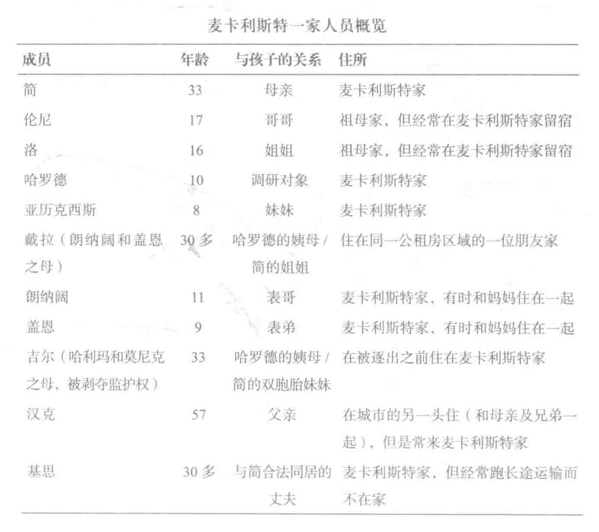

# 第七章 语言作为社交生活的渠道：哈罗德·麦卡利斯特

> 我问哈罗德：“你的 [五年级] 老师怎么样啊？”哈罗德言辞激烈地说：“她特别坏，还撒谎。”麦卡利斯特女士正在洗碗，她静静地听着，而后问：“那个男老师叫什么名字？”哈罗德说：“是林赛先生吗？”他妈妈说：“不是，是另一个。”哈罗德说：“特里恩先生。”麦卡利斯特女士笑了，接着说道：“就是他，我喜欢他。”

远离喧嚣的街道，在距一个小商业区有几个街区之遥的地方，坐落着下里士满贫民住房建造计划（public housing project）。由于通往住房计划的路是个死胡同，加之住在这里的大多数人都没有车，这里的往来车辆十分稀少。不小心误入这里的人也很少。所有的住户都是非裔美国人，周围临近的居民也大多如此（住房计划与城市有很长的一段接壤，那里住的也全都是黑人）。但是，旁边还有一个白人工人阶级居住区，步行就可以走到。这片住房计划被看做是一个危险地带，当地的商家，包括比萨饼店，都拒绝送货到这里来。

麦卡利斯特一家就住在这个住房项目里，他们的住所是由一排一排二、三层高的砖石单元楼组成的。在他们的那一边，这座方块形的棕色单元楼共有五个复式单元。因为楼里的每个房间只有一扇很小的窗户，所以里面很黑。有时候住户们白天还得开灯。外面，每户都有一个用水泥和木栅栏围起的小院子。麦卡利斯特家的单元前面有一棵高大的落叶树；在炎热的夏天，树叶带来了好客的荫凉。楼与楼之间有宽阔的水泥人行道；晚上的时候每个单元的一角都有泛光灯倾泻下耀眼的灯光。很多地方地上都没有草，光秃秃的，上面散乱着废纸、包装和玻璃碴子。

住户们经常一起坐在草地长椅或前面的门阶上，喝啤酒、聊天、看孩子们嬉戏。窗户在夏天通常都是敞着的，以便楼内通风，也可以提供一个视角，让居民们俯瞰临近的地方。

麦卡利斯特一家的两层单元房中，第一层有一个开放型的会客区和一个厨房。客厅的家具很简朴，有两张青绿色的沙发，一张安乐椅，一个木支架上面放着一本打开的圣经。厨房里有一张桌子，离桌子不远处有一台洗衣机（没有烘干机）。蟑螂是恒久不变的难题，虽然已用过多次杀虫剂。因此，食物通常都不会放在外面。冰箱坏了。麦卡利斯特女士已经向房东抱怨过，虽然房东答应给她配置一个新的，但是在我们调研的三个星期里，新冰箱却迟迟未到。麦卡利斯特女士只好先凑合着把一部分食物放在隔壁的朋友拉蒂法家中，另一些则放在装有冰块的冷却箱里。

楼上有四间卧室。有两间可以放下一张双人床，另两间则只能放下单人床。每间屋子里都有一张床和一个梳妆台；为了在修建时减少成本，房间里的壁橱都没有门。墙上没有任何装饰。一个房间的窗户上有一台窗式的空调，炎热的夏天里，楼里也会很热。家里有一个卫生间，三台电视机，其中一台在麦卡利斯特女士的卧室里。与亚历山大·威廉斯的妈妈不同，麦卡利斯特女士对看电视不加限制。事实上，她觉得电视很有用。就像她自己所说，“电视整个晚上都开着，因为我总是整晚地开着电视。我就靠它伴我入睡。”虽然麦卡利斯特家以前曾经装过电话，但是因为预算有限，哈罗德四年级的大部分时间，家里都没有电话。麦卡利斯特女士从她妹妹拉维娜那里接学校的电话，她的邻居拉蒂法也帮她接收消息。

## 家庭

简·麦卡利斯特女士是麦卡利斯特家的一家之主。她有 33 岁，高高的个子，洪亮的声音，非常有幽默感。在我们的家访中，她通常都穿着当年在高中当运动员时的 T 恤衫和毛边超短裤。她现在靠公共救济，但是希望能再次找到工作。麦卡利斯特女士有四个孩子。哈罗德（10 岁）和他妹妹亚历克西斯（9 岁）一直和她住在一起。他们的哥哥伦尼（17 岁）和姐姐洛里（16 岁）主要住在麦卡利斯特女士的母亲家里，坐车到那里只要几分钟。伦尼和洛里平时经常过来，有时候，尤其是周末的时候，他们还会留下来过夜。

麦卡利斯特女士是位很有爱心的姨妈。她让两个侄子朗纳阔（11 岁）和盖恩（9 岁）住在自己家里。两个孩子的妈妈戴拉是麦卡利斯特女士的姐姐，她最近刚刚失去自己的寓所，寄住在这座住房项目里的一位朋友查梅恩家。麦卡利斯特女士得知两个孩子不喜欢他们妈妈的朋友而查梅恩也不欢迎他们后，就邀请他们住在她家。他们每周至少要来四天，在这里吃饭，洗澡，和哈罗德合睡一张床。他们的到来给本就紧张的食品预算带来了更大的压力。

另一个客人是麦卡利斯特女士的双胞胎妹妹吉尔，她吸可卡因上了瘾。她并没有房门钥匙，但有时会从窗户偷着进来，睡在沙发上。吉尔有两个女儿，哈利玛（3 岁）和莫尼克（十个月）。去年，在哈罗德上三年级的时候，吉尔和她的孩子住在麦卡利斯特女士家。后来，吉尔被指控犯有疏忽照顾子女罪，并被剥夺了照顾两个女孩的资格。简和吉尔的妹妹拉维娜收养了哈利玛和莫尼克（她住在离这里乘车约有十五分钟的一个小单元房里）。拉维娜的身体患有严重的残疾，但是在与她同宿的男友帮助下，她仍然能够设法抚养吉尔的孩子。麦卡利斯特女士经常去看望她妹妹拉维娜和她的两个侄女。但是，吉尔只能在他人在场监管的情况下才能去看望她的两个女儿，而她也并不常去看她们（例如，她错过了哈利玛的 3 岁生日派对）。

除了麦卡利斯特女士、孩子们和吉尔之外，麦卡利斯特家还包括麦卡利斯特女士的同居丈夫基思。基思是个长途卡车司机，经常一出车就是好几天不回家。他会在出车的间歇回到家里。他和孩子们打篮球，尤其是和哈罗德打球，但他并没有担任起一个家长的角色。最后，还有哈罗德和亚历克西斯的父亲汉克。汉克和哈罗德的妈妈虽然已经没有恋情了（他们从未结过婚），但他还是经常来看他们。他已经 57 岁了，比麦卡利斯特女士要年长很多（他的女儿比麦卡利斯特女士还要大）。汉克是个机修工。他下班后会随便来看看，往床上一躺就唾着了。麦卡利斯特女士边笑边解释说：“汉克会躺在床上。我会前前后后地忙，而他只是躺着。”

有些周末，哈罗德会乘车到城市的另一头去着汉克。汉克和母亲及两个兄弟住在同一所房子里。晚上留宿通常并不是预先计划好的，哈罗德“就这么过来了” [1] 。亚历克西斯不会和哈罗德一起去。但有时候汉克的女儿（与亚历克西斯同父异母）会过来带她出去玩。汉克定期贴济一家人，比如，周五晚上给大家买比萨饼。他有时候为了孩子还给麦卡利斯特女士钱，尤其是买衣服的钱。儿子作出的每个成绩都让他感到骄傲，他还会去参加哈罗德生活中的一些活动（例如，五年级毕业典礼）。但他并不照顾哈罗德每天的生活起居，也不管教他。

表 3 列出了所有住在麦卡利斯特家的人和经常来探访的人。通常都会有七个人在这里留宿，当基思和吉尔都在家的时候，会有九个人。 [2] 孩子们在不同的晚上会睡在不同的床上。有时候小孩子要靠大人帮忙才能得到一席睡觉的地方：

- 朗纳阔：嘿，简，我上不到床上。哈罗德正伸开了躺在那儿呢。
- 简：让哈罗德的屁股往一边挪挪。他都躺横了。把他往那边推推就行了。

与中产阶级家庭不同，在麦卡利斯特家的单元里，没有一个清楚明确的私人空间的观念。

家里的经济十分困难。麦卡利斯特女士为哈罗德和亚历克西斯接受“儿童抚养家庭补助”，她还有一张供一家人看病的医疗抚恤卡。 [3] 虽然她在使用食品券，但是家里的食品却时常短缺。孩子们吃东西之前总要先得到许可，我们从来没有看到他们自己拿起东西就随便吃。食物一旦拿出来，就会很快消失掉，因为有很多张嘴都在等着吃它们。比如，一个下午，哈罗德和亚历克西斯、朗纳阔和盖恩、邻居家 3 岁的孙子、我自己和麦卡利斯特女士一边聊天一边吃点心的时候，一大整盒撒盐饼干和一些果酱在三十分钟内就通通被狼吞虎咽般一扫而光。

在一些特殊的日子里，有可能有足够的食品。在吉尔女儿哈利玛的生日派对上，就有很多热狗、芥末酱、放了人造香料的果汁和奶酪。然而，大多数时候，食物总是很缺乏。比如一个星期五的晚上，他们只有两个烤比萨饼，但却必须由麦卡利斯特女士、哈罗德、亚历克西斯、洛里、汉克和吉尔这六个人来分享。当哈罗德想要第二块的时候，家人就让他去喝苏打水。又一天晚上，每个孩子晚餐都只能吃一个肉丸子、山药罐头和菠菜罐头，都不够再盛第二碗的了。

钱也总是不够。全家人都放弃了像看牙医、买时尚服装和做头发这样的事情，并共同分担其他东西，像交通费用。 [4] 家里其他人出行的时候，麦卡利斯特女士的姐姐戴拉把自己的汽车月票借给他们，有时朋友会开车送他们出去。在孩子中间，对钱的希求及对钱能带来的物质资源的渴求，都很明显。一天早上，伦尼过来时手里拿着几张一美元的纸钞，在其他孩子眼前晃着，他们都叫闹起来。他们许愿时的那种渴望也是显而易见。在回答“如果你有一百万你拿它来做什么”时，亚历克西斯说：

> 呵，好家伙！我会给我的哥哥、妹妹、叔叔、姨妈、侄女、侄子、还有我姥爷、姥姥、妈妈、爸爸、还有我的朋友，不是一般的朋友，主要是我最好的朋友——我会给他们所有人买衣服……和运动鞋……我还会买吃的东西，我会给妈妈买吃的，还会给我的哥哥们和妹妹们买生日礼物。

可是，哈罗德和亚历克西斯却不会非要妈妈或爸爸给他们买东西：

> 我们在 [一家服装店] 外面停下来，汉克很仔细 [地看着] 那里的衣服和价格……哈罗德也看着……哈罗德看起来很不想讲话的样子，几乎是有点儿警觉。他让爸爸决定到底要怎样。一路上我从来没有听到他说“我能买 X 吗”或者“我能要 Y 吗”这样的话。我们走过了糖果、录像带、书籍杂志、运动衣、运动书包，他却从未讲过要任何东西。

就像这则实地笔录中所暗示的，在看到了那么多工人阶级和中产阶级孩子时常要父母给他们买东西之后，哈罗德对自己的压抑让人感到十分不安。

但是哈罗德也并没有过着一穷二白的生活。麦卡利斯特女士坚决地履行着满足孩子基本需求的责任，同时，只要有可能，她都会给他们“额外的”东西。例如，调研人员注意到，有时候她会给孩子钱到住房项目附近的商店里去买一杯苏打水或是一包土豆片。麦卡利斯特女士认为自己是一位很有能力的母亲。和亚历山大·威廉斯的母亲一样，她也希望自己的孩子成功和快乐。她努力在生活中为孩子们提供一种强大的积极的影响（与住房项目里其他吸毒成瘾的那些母亲不同），但是她眼中父母亲的角色职责与威廉斯女士的却又截然不同。在麦卡利斯特家，就像在其他贫困和工人阶级家庭中一样，家长的关键性职责就在于在物质上照顾孩子、给孩子提供衣服和住所、教他们辨别善恶对错、给他们以安慰。在所有这一切中，语言扮演着重要又实用的角色。与威廉斯女士不同，麦卡利斯特女士并不会不断地试图丰富哈罗德的词汇量，不会去培养他的语言（或体育）天赋，也不会力图说服他如何如何去做。当哈罗德抱怨的时候，就像在本章的开头，他抱怨老师“撒谎”，他妈妈只是静静地听着，然后提醒说他也有自己的确喜欢的老师；但是与威廉斯女士不同，她并没有让儿子把话题展开。麦卡利斯特女士经常给出简短而清晰的指令，同时她也要求得到快速而尊敬的顺从。哈罗德很少向大人给出的指令提出挑战，他也不会试图同父母理论或磋商。然而，虽然麦卡利斯特女士在孩子和成年人之间划出了分明的界限，但她并没有因此而对哈罗德的活动严密管控。他和其他孩子都可以不经她批准就去自由地做游戏，看电视，跟朋友一起玩。在中产阶级孩子的世界里，各种活动常常会代替与亲戚来往的时间，相比之下，对麦卡利斯特一家来说，大家庭的网络联系则起着重要的作用。

这种养育子女方式的不同，尤其是在语言运用上的不同，在家庭内外都影响着孩子的生活。例如，亚历山大·威廉斯在看医生时表现出来形成中的优越感，就是通过他运用语言控制医生对他的看法来塑造发展的。亚历克斯在成年人面前应对特别自如（以至于他会去随便打断医生）。他去看过足够多次的医生（译者按：在美国，人们不只有病才看医生，更多的是为日常保健而看医生），因而对常规的检查十分熟悉；而且，由于他习惯了别人问他问题，也习惯了别人专注地倾听他的回答，他能很流畅地为他人提供信息。哈罗德为了参加圣经营地而到诊所里做体格检查的时候，情形却大不相同。对医生和其他专业人员的不信任，对医疗职业及其专用术语的不熟悉，这两点合在一起，让他妈妈一时语塞，也让他感到十分拘束。亚历山大认为是理所当然的语言技能和对话技巧，哈罗德却都没有。他对别人的提问和深究都不熟悉，而且他也没有向有权威的人提出特殊要求的经验。其结果，就是一种形成中的局促感。哈罗德所受到的教养也有很多积极的方面——在同伴面前的轻松自如、在创作游戏和安排自己时间方面的足智多谋、他对待成年人抱有的尊敬态度、他和家人之间深深的亲情——但在社会机构的“真实世界”里面，它们几乎都被当成是毫无价值的。教育工作者、医疗保健专业人员、雇员们和其他人士都接受（而且帮助再现）同一种意识形态，在很多其他的能力中，这种意识形态重视说理和协商的技巧、巨大的词汇量、言谈之间和与陌生人合作时的应对自如，以及时间管理能力——这些都是像亚历山大·威廉斯这样的孩子在日常生活中发展起来的品质。通过仔细审阅哈罗德生活的一些部分，尤其是语言的作用，这一章揭示出了，在不同之处渐渐被定义为不足之处的时候，这些机构制度上的偏好是如何演变成为制度化了的不平等的。

## 让哈罗德做“朴实的老好哈罗德”：成就自然成长

哈罗德·麦卡利斯特是调研的目标儿童，他在下里士满小学读四年级。他宽宽的肩膀，结实的体格，看上去很有派头，像个崭露头角的橄榄球运动员。下面是亚历克西斯对她哥哥的描述：

> 哈罗德就是朴实的老好哈罗德。他从来都不会改变。他总是一次一次又一次地反复做同一件事情。他听广播。他打篮球。他又听广播。他看电视。他睡觉。他看电视。他听广播，他看电视，他打篮球。他就是朴实的老好哈罗德。他从来不做任何有趣的事情。

在哈罗德看来，“一次又一次地做同样的事”很有趣。他喜欢体育运动，不管是哪一天，他都会很高兴地去打篮球（他尤其喜欢篮球）或是打橄榄球，他很严密地追看专业体育比赛。大多数下午，他都要么是在看电视，要么更有可能做的就是在外面打球。和他一起玩的小孩有时多有时少，但是和亚历山大·威廉斯不同，哈罗德总能找到和他一起玩的孩子。麦卡利斯特家周围一排排的单元楼里住着四十个小学年龄的孩子。有这么多孩子住在附近，哈罗德选择了只跟和自己同龄的孩子玩。事实上，他既和比自己大也和比自己小的孩子玩，还和自己的表兄弟一起玩（他们都年龄相仿）。

## 家庭纽带

与亚历山大·威廉斯和加勒特·塔林格不同，哈罗德很容易就能和自己的大家庭聚在一起。他的表兄弟朗纳阔和盖恩基本就住在他家，他的几个姨母都住得很近。但是家庭纽带并不仅仅是相聚方便。那个把哈罗德与他的表兄弟姐妹、他的几位姨母、他的祖母、他的父亲，以及他父亲的亲戚连接起来的纽带，对哈罗德来说是至关重要的——他们构成了他生活的环境。在任何一天，他都很可能会和朗纳阔睡一张床，和盖恩玩一个篮球。他会为他的姨母跑腿做事，他会自己坐车去找祖母或是父亲的亲戚。

像生日这样特别的日子，哈罗德都是和他的亲戚一起度过的。与中产阶级家庭不同，在麦卡利斯特家，派对所邀请的人并不是学校或课外活动中的朋友。大家庭中的成员们把他们的资源和能量汇总起来，充满热情地庆祝生日。到时候会有生日蛋糕和特别的食品，但礼物却不是生日派对的一部分。与此相似，圣诞节时会有圣诞树和圣诞食品，但却没有圣诞礼物。在这些和其他家庭活动中，当成年人一起娱乐聊天时，年长一些的孩子会主动与较小的孩子一起玩并照顾他们。

## 日常生活的组织安排

有组织的活动是亚历山大·威廉斯和加勒特·塔林格闲暇时间的支柱，但是这些活动在哈罗德的生活中却是根本就不存在。 [5] 在闲暇时他可以按自己的喜好安排时间。他喜欢同小朋友和亲戚家的孩子一起抛橄榄球，他还组织篮球比赛，篮球筐就是住房项目街边电话竿上那个锈迹斑斑、没有球网的铁环。他们享受体育活动的一大障碍就是缺少器械。到处找球是哈罗德闲暇时间的一个常见部分。例如，六月一个湿热的下午，哈罗德、他表弟盖恩和一名调研人员在住房项目里转了约有一个小时，四处寻找篮球。下午晚些时候，在听完音乐和看过棒球卡后，哈罗德加入到盖恩和其他孩子当中打起了由益恩挑起的水仗。游戏十分热烈，充满了欢笑，孩子们还试图把隔壁的成年人也浇湿了（虽然大人并不愿意）。

哈罗德每日的活动让他有事可做，但是与亚历山大·威廉斯和加勒特·塔林格不同，他从来不会因为这些活动而感到疲惫。缺乏成年人组织的活动让他可以自由地创造自己的消遣方式，自由地为自己定下步调。他在体育运动上磨炼自己的技能，他在寻找器械和玩伴上足智多谋。他很擅长与比自己大得多或小得多的孩子打交道。但是哈罗德却没有得到那些因被成年人认可而为他生成优越感的技能。他也没有获得对工作相关常规的熟悉感知，而中产阶级孩子通过参与多种有组织活动对那些工作相关日常规则十分熟悉。

哈罗德在外面玩的时候，他的举止与他在家中的单元房里截然不同。在家里，他很安静，几乎是近于沉闷。他从不大声说话，从不到处乱蹦乱跳，只是偶尔说上几句简短的话，也不爱争论。在外面，尤其是在他运动的时候，那种在成年人面前常常表现出的恭敬和屈从就会让位给一个更加活泼、果断自信的自我。（在本章后面描述的篮球赛中，这种变化可以看得十分清楚。）有时候，如果情绪非常激动或气愤，哈罗德就会有些口吃。他妈妈解释说：

> 他已经上了好像有三年的会话训练课了，但他就是说话时不放慢速度。如果他肯放慢速度，然后再讲话——但是如果他在笑或哭的时候，你得等他平静下来才能听懂他究竟要说什么。

哈罗德经常笑，不怎么会哭。麦卡利斯特一家都非常非常地喜欢嬉戏，笑声和玩笑时常萦绕耳边。甚至在我们的研究已经开始的时候，他们的幽默感也很显而易见。调研人员问哈罗德他周六几点钟起床。当哈罗德说早上 7：00 的时候，调研人员回答说她会来得比 7：00 早一点儿，大概会 6：30 过来。朗纳阔最直接的反应就是，“倒霉，他们比耶和华见证会的人还要糟糕！”他的话让所有在场的人都开怀大笑。哈罗德的妈妈尤其滑稽风趣。她经常面无表情（即，没有感情色彩）地说出最可笑的话。比如，在团员野餐上，我到的时候已经来了大约 200 人了。麦卡利斯特女士提醒一个调研人员都有谁已经到了：

- 简：安妮特在这儿呢。
- 调研人员（环顾四周）：哪儿呢？
- 简：她是这儿唯一的一个白人，你还找不到她吗？（笑）

## 种族的角色

一天晚上我在麦卡利斯特女士家里留宿，10：00 左右的时候，我和她走到另一个单元，把戴拉的汽车月票还给她。从人们看到我的表现可以看出，白人在住房项目里有多么少见。在路上，麦卡利斯特女士停下来和两个朋友聊天，他们都坐在一辆白色的旧卡车上喝酒。麦卡利斯特女士介绍我说：“这是我的朋友安妮特。她要把我儿子写在她的书里。”后来，她对我解释了为什么要这样介绍我：

- 简：他们看到一个白人和一个黑人一起走，他们会认为你吸毒。（我们两个人都笑了。）
- 简：我是当真的。他们会说，“要吗？”[要买毒品吗？]
- 调研人员：我白天四处走动的时候，他们以为我是公共事业部的人呢。
- 简：我跟你说了嘛。 [6]

在住房项目外面，哈罗德的世界只多了那么一星半点的白人。周围城区里的种族隔离程度被认为是“超高”的，就像很多美国的城市一样。 [7] 离哈罗德家仅有几分钟的商业区中，店主来自各种不同的种族。哈罗德常到玛丽亚的便利店给大人跑腿买东西（有时也会给自己买点零食），店里的员工包括白人、亚裔和一些非裔美国人。住房项目旁边有一个可以步行到达的白人工人阶级居民区，但是哈罗德并不会到那里去玩。麦卡利斯特女士汇报说，万圣节的晚上她和一个朋友带着孩子越过种族界限到那边去“要糖果”。他们每年都去同一些人家，“那几家人都认得我们”。有时也会出现各种问题，包括人们看到黑人孩子来了就把灯关掉表示不欢迎。麦卡利斯特女士抑制住自己对这种行为的厌恶，只说了句“那些家长都好愚蠢啊。”

在学校里，种族的平衡发生了转变。如前所述，作为一个大型市区的一部分，下里士满区的各个种族都杂居在一起：约有一半学生是白人，大多数老师也是白人。大多数行政人员，比如清扫院子的员工和自助餐厅的服务员，也都是白人。有些助理教员是黑人，大多数校车司机都是黑人。哈罗德三年级时的老师是位非裔女教师，今年是一位白人男教师。

麦卡利斯特女士告诉那位研究开始时与她做访谈的非裔调研人员说，她没有见过哈罗德的学校里有任何一个黑人孩子或白人孩子因为种族而受到不公正的待遇。虽然麦卡利斯特女士很清楚地意识到有些人“表现得很愚昧”，但是与威廉斯女士不同，她没有对种族给孩子人生带来的影响表达自己的忧虑。相反，她大体上强调了正确照顾孩子的重要性，尤其是对“什么都不为孩子做”的成年人表示了不满。

## 指导自然成长

与威廉斯女士一样，麦卡利斯特女士坚信家长应该照顾好孩子。与威廉斯女士不同，她根据自然成长来定义对孩子的照管。也就是说，她强调父母为孩子提供食物、住所、衣服和良好监督的重要性。麦卡利斯特女士是她所在这部分住房项目的楼长。在她负责的众多事务当中，夏天时她要负责管理附近一个消防栓的“喷水帽”；炎热的夏天里，住房项目里的居民可以用它来喷水降温。只要不摘掉喷水帽，消防栓喷出的水就不会给来嬉戏的孩子造成危险。她对住房项目里其他家长如何使用消防栓十分不满，对那些家长处理其他与孩子有关的活动也很有意见：

> 他们在那边拿着五个消防栓玩。又吵又闹。昨天他们把三个的喷水帽都打开了，水特别冲……这些人什么都不为自己孩子做。他们 [孩子们][早上]9：00 就走了，下午 4：00 才回来，也不告诉家长他们上哪儿去了。（摇着头，很厌恶的样子。）

虽然麦卡利斯特女士并不主动去干预孩子们的日常生活，但她确实会达到她给自己确定的作为家长应承担的义务。因此，虽然去开家长会需要坐公交车，她还是会去的。同样，虽然她自己在医疗工作者面前并不是很自在，她仍然会带哈罗德到医生那里去体检，让他能够参加圣经营地。在资金很有限的情况下，她设法给自己的侄子和孩子买到足够的食品。她做晚饭。当孩子参加营地活动需要新衣服的时候，她安排哈罗德的父亲带他去买衣服。有时候，她会和孩子们“在一起待着”，看他们打篮球或者和他们开玩笑。

麦卡利斯特女士还强调说，她会和孩子一起做些特别的事情：“夏天我会带他们去野餐，把吃的东西放在小毯子上。”而且，

> 我们总是在情人节那天去 [动物园]，因为在那天孩子们可以免费进去。我们大概每年去四、五次，也是在夏天。我喜欢周三晚上去，那时候那里的孩子比较少，还不错。

麦卡利斯特女士对照顾好孩子的承诺还体现在一个她不得不做的艰难决定上。她的双胞胎妹妹吉尔因吸毒而妨碍了自己照顾哈利玛和莫尼克的能力，在（调研开始前）和她经过长期的苦苦挣扎之后，麦卡利斯特女士给公共事业部打了电话，举报她妹妹疏忽照管儿童。对此她做了如下解释：

> 调研人员：谁给公共事业部打的电话？
> 简：我打的。我对这个厌烦透了。哈利玛的哮喘犯了，她却连续四个小时都没有回来。我真是厌烦透了。那天我给公共事业部打了六、七次电话。我厌烦了让我的孩子们看着他们。伦尼和洛里和哈罗德，还有亚利克西斯和朗纳阔。他们应该有自己的（犹豫了一下）应该有自己的童年。她却甩手一走了之。

孩子身体上的健康安全对麦卡利斯特女士来说也是至关重要。比如，万圣节的时候她带孩子们到各家去“不给糖就捣蛋”，她限定他们只能吃一小袋糖；他们也不许吃“玉米形糖……蘸了糖的饼干、橘子和苹果”。而且，就像本章后面提到的，她还教年龄较小的孩子要远离住房项目中那些“有问题的”成年人，并责骂十几岁的洛里不该和“不三不四”的人来往。对几个调研人员她也同样抱着保护的姿态。她曾在偶然间对我说：

> 我对那个毒品贩子说：“那个 [调研人员] 要来研究我儿子。我叫你别给他捣乱，否则我就跟你没完。” [8]

麦卡利斯特女士为自己获得了高中毕业文凭而感到骄傲，她把自己的期望传达给孩子们，要求他们每一年级都要升上去，不许留级。亚利克西斯说：

> 她说，如果你留级了，你整个夏天都得挨罚。我惊得眼睛都瞪大了，就像这样（示范了一下）。我都害怕给她看我的成绩单了。我那次自己没有看就给了她——她说：“你没有及格。”我吓了一大跳。我说：“给我看看！”然后我着了自己的成绩单，我说：“我及格了。”

亚利克西斯还强调了她妈妈的品质：

> 我们家一点儿也不脏不乱。因为我妈妈，我是说，那次有个男的把酒瓶子扔到了马路上，那个瓶子滚呀滚呀，差点儿把一辆车的轮胎都扎破了。所以我妈妈让我把碎玻璃踢到马路牙子上。那个男的说：“你看她，她正打扫呢。她把碎玻璃给打扫了。”因为我妈妈就是这么爱干净。

同样的，哈罗德看起来也为妈妈掌管消防栓的喷头而感到骄傲。总的来说，麦卡利斯特女士被自己的家人和邻居看做是一位称职的母亲和好公民。

## 日常生活中的语言：言词简短朴素

与我们观察的其他贫困和工人阶级家庭一样，麦卡利斯特家的生活并不会围绕着长篇大论的讨论而进行。这些家庭的谈话时间会有差异，但是总的来讲，要比中产阶级家庭少得多。 [9] 句子要更简短，用词也更朴素，一起商量的次数很少，任何一种像我们在塔林格和威廉斯家看到的那种文字游戏几乎都不存在。 [10] 这并不是说贫困和工人阶级家庭认为交谈不重要。麦卡利斯特一家也会谈论他们的亲戚朋友，讲笑话，评论电视节目——但是他们只是断断续续地说起这些。简短的话插入到令人舒服的沉默中。有时他们会完全绕过言词交流而使用肢体语言——点头、微笑和眼神交流。麦卡利斯特女士讲话时通常都是简单明了、直截了当，她并不试图引导孩子们说话或表达自己的观点。在大多数场合中，孩子们都可以自由地讲出自己的想法，但她并不明确地鼓励他们这样做。总的效果就是，语言成为日常生活中一条实用的渠道，而不是一种培养说理能力的工具，或是一种探究表达思想感情的方式。 [11]

在家里，孩子之间经常讨论钱的问题。他们看到报纸上的广告，评论各种物品的价格。他们谈论谁会给他们钱（比如，一个邻居在朗纳阔陪她到银行的取款机取出钱之后给了他五美元）。麦卡利斯特一家要对付严重的经济困难，这就让家里所有的人对物品的确切价格以及哪里能买到便宜货都十分敏感：

> 简递给哈罗德和亚利克西斯每人一袋焦糖玉米，他们很快就打开了。她责怪他们说：“你们干嘛把袋子打开？”他们没有回答。不知怎的，他们说起焦糖玉米的价格来。简说，她是在坡上的加油站买的，那里正在降价——一美元两袋，平时都卖九十美分一袋。 [12]

这种断断续续的谈话，仅仅是穿插在成年人的指令性话语之间。成年人告诉孩子要去做某些事（例如，洗澡、倒垃圾），而不要去做另一些事（例如，骂人、顶嘴）。麦卡利斯特女士用只有一个单词的指令来协调全家人使用唯一的一个卫生间。单元房里总是至少有四个孩子，平时常常会有七个，再加上麦卡利斯特女士和其他成年人。麦卡利斯特女士指着孩子说“卫生间”，并把毛巾递给他／她，她就是这样来叫孩子洗澡的。被指定的孩子无言地站起身，上卫生间去冲澡。

孩子们通常都会按照大人指令去做。即使成年人给了他们很费时间的任务，我们也没有看到过抱怨或抗议，比如，洛里被指定去给戴拉姨妈的朋友查梅恩 4 岁的女儿编辫子，她花了一个小时才把辫子辫好：

> 有人对洛里说：“去 [给泰内莎] 梳个头，她要去野营。”洛里什么也没说，站起身，带着小女孩进了里面。她们走到电视旁边的沙发旁，洛里坐在沙发上，小姑娘坐在地上。[泰内莎] 静静地坐了约有一个小时，歪着脑袋，洛里很仔细地给她辫了一头的小辫。

洛里无言的服从十分具有典型性。大体上，孩子们都是毫无意见地去做大人要他们做的事情。例如，一天晚饭时，哈罗德抱怨不爱吃菠菜后，他妈妈叫他还是要吃完：

> 妈妈（大声地）吼他，叫他吃菜：“吃！把菠菜都吃光！”（没有回音，哈罗德在桌子边磨蹭着。）盖恩和朗纳阔还有亚利克西斯都吃完走了。我和哈罗德一起吃完，他把菠菜吃掉了。他把芋头都剩下了。

也许是因为他们都觉得孩子应该令行禁止，所以成年人常常并不解释他们为什么要求孩子那么做，但是，对指令的解释也常常是和指令本身交织在一起的：

> 简和朗纳阔在我前面一点走着。我走在他俩中间，但是朗纳阔一直不时偏到我这边，挡在我前面。简责备他说：“朗纳阔！走直了！别挡着她的路！”他笑了笑，往边上揶了挪，然后说，他的朋友们经常因为他走路不直而揍他。没过一会儿，他又偏到我前面了。这一次，简生气了，“朗纳阔！别再走偏了！”他看起来吓了一跳（他的眉毛随着瞪大的眼睛扬得老高，脸上露出一个不好意思的微笑）。

朗纳阔并不是有意不服从他的姨母——他只是注意力不集中。而有时候，违反成年人的指令则是比较故意的抉择。哈罗德态度坚决的时候，就会大声地讲出来。他会很简约但很清楚地提出反对意见。在威廉斯家要展开到几分钟或更长时间的讨论，在这里被很快提出并迅速得到解决，就如下面这个例子所示。在这个例子里，哈罗德、他的爸爸，还有我一起去为哈罗德买圣经营地所需的物品。

> 哈罗德从最底下的架子上拿起一条普通的蓝色 [沙滩毛巾]。他举起毛巾。他爸爸说：“你想要一条普通的？”哈罗德点点头。他爸爸接过毛巾，放到购物篮里。接着他爸爸又沿着一条货架间道逛了下去……然后，拿起一套桃红色的 [毛巾] 看着，毛巾上有一只白缎的鸭子贴画。他说：“这些都有 [一套]，但是缺条大毛巾。”（麦卡利斯特先生似乎觉得这套更值。）

哈罗德很坚决地拒绝了那套桃红色的毛巾：

> 哈罗德走到那边看了一眼 [那套毛巾]，然后坚决地摇了摇头。他说：“都是女孩子的颜色。”他爸爸把桃红色毛巾举了起来，暗示哈罗德没有看对，而且应该买这套。他看了看毛巾又看了看哈罗德。他爸爸看上去是在（无声地）温和地抗议，但也在微笑着。哈罗德看起来可一点也没觉得很搞笑。他又摇了摇头，果断地说：“女孩子的颜色。”他爸爸笑了……[但是] 看上去不知道下一步该怎样。他在各处转了转，朝购物篮里看了看，然后又拿起了那条蓝色的毛巾。[他] 打开蓝色毛巾，我伸出胳膊，表示要帮他，我们把蓝毛巾全打开了。约有 1.5 米长。哈罗德摇摇头说：“太大了。

整个交流过程中，哈罗德说了不到十个词。他爸爸说得稍多一点，但是比起威廉斯夫妇引导亚历山大说出自己观点时会说的话，要远远少得多。

虽然哈罗德反对买那套桃红色的毛巾，但他实际上并没有跟父亲争论。他只是重申了自己的观点。我们在这个家庭里只看到过一次孩子主动与大人争论的情况。引发争论的话题是食品，这也对当时孩子的坚持和成年人的忍耐起了决定性作用。

> 我们出门坐公交车到拉维娜家给 3 岁的小表妹过生日的时候，麦卡利斯特女士一边带着大家过马路一边对我们所有人嚷道：“你们都得在拉维娜家吃得饱饱的，因为我们回来以后就不会再做饭了。”
> 
> 晚上大约 10：00 的时候，全家人都回来了，坐在一起看电视上的篮球季后赛，并准备睡觉。在简的房间里，亚利克西斯背对着门坐在床的正中央，朗纳阔坐在床的一个边上，背靠着墙，两腿向前伸直。天气很热。空调没开。

麦卡利斯特女士宣布要在拉维娜家吃饱的时候，朗纳阔没有跟他们那拨人在一起，现在他来要吃的了。请注意，在他姨母认定他听到了去之前的忠告时，他并没有去纠正麦卡利斯特女士。相反，他只是声称自己不喜欢热狗——因此也不吃热狗：

- 朗纳阔：我能吃点东西吗？
- 简（吃惊地大声说）：一点吃的？我难道没跟你说要在拉维娜家吃得越饱越好吗？
- 朗纳阔：我是吃了但是 [我不喜欢那些吃的]。
- 简：这儿没有吃的。我告诉你们了……
- 朗纳阔：我才不吃热狗呢！
- 简（生气地）：你说什么？
- 朗纳阔：我不喜欢热狗。（高声地替自己辩护）我不吃热狗。你问我妈妈。我不吃热狗。
- 简（十分生气地大声说）：那你妈妈应该在我们做那些该死的热狗之前就告诉我们。我现在告诉你，我是不会给你做饭的，知道了吗？ [13]
- 朗纳阔暂时被亚利克西斯打断了。两人都（和麦卡利斯特女士一起）坐在单人床上：
- 朗纳阔（对亚利克西斯）：别挤我！我发誓，你一点儿地方都不给别人留。

麦卡利斯特女士相信她听到亚利克西斯骂脏字了。

> 简（用报纸在女儿腿上猛打了一下）：我要打你屁股了，听到没有？
> 
> 亚利克西斯：妈妈，我没有那么说！
> 
> 简：别跟我耍 [滑头]。你能区分对错。现在我要在上边儿这儿 [打] 你这混蛋的头！

然后，哈罗德的妈妈做了件很少见的事，她问朗纳阔有什么烦心事。由于派对之后她（还有我和哈罗德）是坐公交车回家的，而朗纳阔和亚利克西斯还有其他人都是有人开车送回来的，她想知道是不是在车上发生了什么不愉快的事情：

- 简：朗纳阔，在车上发生什么事儿了？车上到底怎么了？在拉维娜家里有什么事儿吗？
- 朗纳阔：（咕哝着）没事儿。
- 简：那你干嘛这种态度？
- 朗纳阔：她 [亚利克西斯] 总烦我。
- 简：朗纳阔，你让每个人都心烦，但是可没有人对你这么说话。
- （短暂的沉默，电视上的篮球赛还在继续。）
- 简 [对在场的每个人]：我是不是在出门之前跟你们说来着（要吃饱了）？
- 亚利克西斯：对。

按麦卡利斯特家的标准，这段交流有好几处都很不寻常。对话很长，又包括孩子向大人挑战（虽然是间接的），而且还记录下了哈罗德的妈妈有意地从一个小孩那里寻求信息。

在麦卡利斯特女士使用指令来保护和训练孩子的时候，依照中产阶级的标准来看，她的方式显得粗简无礼。比如，在她警告亚利克西斯和朗纳阔不要搭理住房项目中那些有问题的人时，她的言辞很简短很直接，但却并不是不友善：

- 简：谁？里普？里普是个酒鬼。我告诉过 [你们] 里普的事。（过了一会儿）他今天 3：00 前就喝醉了。
- 亚利克西斯：他开吉普车。他开车把杰罗姆送来了。
- 朗纳阔：他怎么你了？
- 亚利克西斯：他对我说脏话来的。
- 简：我来告诉你们里普是怎么回事吧。（嚷道）不要搭理他，好吗！他就是有问题。

无论是我们观察到的相对有限的言谈，还是麦卡利斯特女士总会嚷嚷或出语生硬，都不能说明家庭成员之间的情感联络变得紧张了或是受到了妨碍。如果有什么区别的话，在我们看来，麦卡利斯特家大人和孩子之间未曾说出的感情常常比像塔林格家这样话多的家庭更显而易见。下面的例子可以让我们感受一下麦卡利斯特一家是多么擅长——又是多么习惯——无言的交流：

> 哈罗德左手拿着一个盛着热狗和土豆片的纸盘子，右手拿着一听苏打水。他试围用右手打开那听水，突然，他的手滑了一下，苏打水从罐里跳出来，[洒] 到了他的手上和凳子上。他妈妈就站在几尺之外，捕捉到了他的眼神。他们都笑了，笑他在打苏打水的时候手不协调地滑到了一边。那是一种友善温暖的笑，是在和气地取笑他的手扭成那样。然后他妈妈就把东西拿到了烤架上，哈罗德也把手上的水甩掉了。

麦卡利斯特家的每个人都喜欢开玩笑，尤其是麦卡利斯特女士，她似乎更是对任何有可能幽默一把的场合都很警觉。然而，成年人和孩子之间的界限却仍然界定得十分清晰并保持得十分严谨。对年长的人要尊重比什么都重要。孩子们自觉地用尊称来称呼成年人，尤其是成年女性，比如说，拉法蒂小姐或简小姐。此外，麦卡利斯特女士还不允许孩子们骂脏话。 [14]

## 讲圈内话：同龄人之间使用的语言

与在贫困（及工人阶级）成年人与孩子间充满指令的互动不同，同龄人之间使用的语言大都自由畅快。在很多情况下，当孩子们自己玩耍的时候，他们会互相用善意的玩笑来叫板，尤其是男孩子，都喜欢向别人吹牛。在篮球场上，哈罗德会一扫平时沉静的气质。他整个人——包括他的语言——看上去都转变了。哈罗德是个有才华的球员，他既有惊人的速度（对他这么一个块头壮的人来说），又有惊人的攻击性（相对于他在家里的表现来说）。

> 哈罗德判定贾拉德“二次”（二次运球）了。贾拉德一边把球抛给哈罗德一边抗议。（如果你判定对方二次运球，你就能得到球。）贾拉德（生气地）：“你这家伙，我没有二次——小气鬼，你这瞎了眼的臭大粪！”哈罗德停住拍球，走到贾拉德面前。哈罗德（嚷着）：“你就是二次了，嘿！就像这样。”（哈罗德开始运球，他旋转了一下，然后做了个假动作，然后做了一个很夸张的二次运球。）“我看到你这样了！”他也没有问其他孩子对此有什么看法，他们也什么都没有说。哈罗德得到了球，然后又抛到场内开始玩了。（通常如果有人犯规了，他们就会从头玩起。这一次却不同，哈罗德得到了球。）哈罗德被判犯规，“走步。”（他由于带球走步而犯了规。）哈罗德（抗议道）：“我走步？小气鬼，你疯了吗！看你能不能拿到球——我要再来一次。我可没有用骗术。”哈罗德把球留下了。没有人提出抗议。

与中产阶级的孩子相比，哈罗德和他的朋友们有更多的自由，不受成年人的限制。大人们经常都不在他们身边，而且当他们在场的时候，他们通常也不会干预孩子之间的互动。比如，这一点在调研人员描述哈罗德和他的（法定）继父时表现得十分清楚，一个下午，基思和哈罗德一起玩投篮：

> 哈罗德和基思都很放松。他俩都不是非得得到回弹不可，也不是特别想表现自己运球的技巧。哈罗德投中了不少球。基思却没有这么老练。

在这种随意的投篮继续进行的时候，约有十个少年加入进来，他们的年龄从 7 岁到 15 岁不等。

> 其他这些人一来（他们好像都是一起到的），球赛的步调就变了，变得更加炫耀技巧也更有竞争性。虽然并不是真正的比赛（没有人计分），却执行了明确的攻守策略。比如，哈罗德多次叫他的朋友们“来抢球啊”，这就起到了一个邀请竞争的作用……他们都 [试图] 防止哈罗德投球入篮。哈罗德打篮球极有才华。

哈罗德通过引入第二个挑战来提高游戏的竞争性：

> 哈罗德提出挑战：“过来呀，好让我打断你的脚踝。” [15] 这个挑战是对所有敢接受的人发出的，不论老小。那个 [之前加入进来的] 上了年纪的人，为了帮哈罗德找到接受挑战的人，大声叫着：“贾拉德——出来给我们显显身手。别让他把你的勇气都扫光了。”（注意这句话里的文化潜台词，他在暗示，一个人要想被大家接受就必须得强悍或是有男子气。）贾拉德回击说（同时对哈罗德摇旗示威——就是，挥起胳膊做击打状——通常会被理解为一个贬损的手势）：“哈罗德对我一点威力都没有。”他走到哈罗德跟前堵住了他（摆出一副防御的架势——直对着哈罗德，伸着胳膊蹲伏下来）。他的眼睛从哈罗德的眼睛上移到了球上。

随着逗秀的展开，球场上那些原本在用另一个球投篮的人们也都逐渐停了下来，过来看他俩打球。

> 所有的眼睛都集中在哈罗德和贾拉德身上。哈罗德兴奋起来，（用力地拍着球）企图威慑贾拉德。“你准备好让我打断你的脚踝了吗？看这个，你们都看着。”（每个人已经都在看着了。）

> 哈罗德一点预警都没有就直冲向了球篮。贾拉德朝球猛击。哈罗德逗惹他说：“你想让我把球给你送上门儿来吗，小牛犊儿？” [16] ……贾拉德在哪里击球，球都已经不在那里了……很显然，贾拉德根本不是哈罗德的对手。基思和另外那个年长的男子相视而笑。现在哈罗德在离球篮有 1.2 米的地方。他在两腿之间运着球，然后 [驱球] 在自己脖子上绕了一圈，身体又旋转了一圈，带球跑了两步，然后发力投球。他没有投中。

> 虽然哈罗德并没有投中，但他仍然得到了各种形式的赞扬和赏识。 [17] 这些赞誉都洋溢在他们的微笑中，他们庆功的击掌上和各种评论上，比如说，“妈的——你看他有多棒！”和“贾拉德这个废物——这小子就不会打球。”……哈罗德（吹着牛）炫耀着：“就是！怎么样吧？你们这帮人都不是我的个儿！我把那小子给揍了——年轻人技术就是好！”

哈罗德技术的确是好——他除了运球、传球和投篮都很棒之外，还很擅长战略部署；他足智多谋又有创造力，他对比赛规则十分熟悉，他还知道什么时候去挑战、什么时候去嘲弄。总之，在球场上他很淡定很自信。在这里，他讲的话都很多很详细，加了很多华丽的润色。但是在他与老师和家长互动的时候，他的言谈交流却是另一种不同的形式。再有，虽然他的这些才华在这个环境中十分重要，但却不像中产阶级孩子在有组织的活动中学到的技能那样，那么容易转化到教职人员、雇主或医护专业人士的世界中去。在球场外，在成年人面前，哈罗德又变回到了“朴朴实实的老好哈罗德”，不大强悍有力，更恭顺，也更安静。

## 管教用语：指令和威胁

不管大人给他们的指令是去洗澡、倒垃圾、给另一个孩子辫小辫、还是吃青菜，贫困和工人阶级家庭中的孩子都常常会及时而沉默地去执行。这种沉默和执行也常常是他们对口头管教的反应，甚至是在言词管教中夹带着体罚的威胁时也是如此。在下面这个例子里，亚利克西斯受到姨母拉维娜的责骂。她并没有为自己辩驳。事实上，她只作出了一次直接回答——一个无言的点头——当她姨母看起来是要求她回答的时候。在整个这一段中，亚历克西斯站在拉维娜厨房里的桌子旁，她的双手放在一把木椅子上。拉维娜站在同一张桌子的另一端，她没有和亚利克西斯的妈妈商量，就对孩子进行了训问并下达了最后通牒。显然，她很生气，亚利克西斯感到很羞愧：

- 拉维娜：嘿，孩子，听说你今天在学校表现不好。
- （朗纳阔说了点什么，嘲笑亚利克西斯犯错误了。）
- 拉维娜：闭嘴，朗纳阔。
- 拉维娜（又转向亚利克西斯）：到底怎么了？你显然有问题，你在课堂上到处蹦蹦跳跳，耍来耍去的，是吧？
- （亚利克西斯没有抬头也没有回答。）
- 拉维娜：我们是不是早就讲过这个问题？
- （亚利克西斯没有回答。）
- 拉维娜：你知道，亚利克西斯，行为表现很重要。如果你在学校表现不好，在小学就不好，那你长大后表现会怎样呢？在工作上会怎样？嗯？
- （亚利克西斯没有回答。）
- 拉维娜（对着朗纳阔，然后又转向亚利克西斯）：我都和你们说了两个月了……你们总给我同样的老借口。你为什么不好好表现呢？
- （房间里一片沉默。拉维娜盯着亚利克西斯。亚利克西斯盯着椅子出神。）
- 拉维娜（重复自己的话）：我真的真的不耐烦了。你为什么不好好表现呢？
- （亚利克西斯还是没有说话。朗纳阔进来又出去了，在他的人工香料果汁里放了点糖。）
- 拉维娜：再有几天这个学年就结束了。别再让我听到你表现不好了，好吗？
- （亚利克西斯点了点头。）
- 拉维娜：我真的不想打你的屁股。那可是我的最后一招儿。

在斥责中，就像在其他大人和孩子之间的交流中一样，大人讲话，孩子听着。和中产阶级孩子不同，这些孩子不会用探查口风、争辩和质问成年人这些手段来考验大人的极限。这种管教方式一个意料之外的后果就是，贫困家庭和工人阶级的孩子往往没有发展出与中产阶级孩子同样多的语言技能。他们没有什么机会练习和成年人协商事务，没有人让他们作总结或提出自己的想法、观点和借口。不对成年人提出质疑的习惯也意味着这些家庭的孩子们也不太能学到新的词汇。

## 体罚

当拉维娜用威胁要“打”亚利克西斯来支持自己的指令时，她用了在我们看到的贫困家庭和工人阶级成年人中常见的策略。麦卡利斯特女士也使用类似的行动方针，尤其是在孩子做的坏事让她生气时。就连 16 岁的洛里也不能幸免：

> 简生气了。（简走到洛里跟前，径直站在她面前。简生气地大声嚷着）：“你最好别再让我看到那些坏孩子的车停在坡下面，不然的话，我就朝上一拳（猛击）正中你的脑袋瓜，我说话算话。”

和她的姐妹拉维娜一样，麦卡利斯特女士把体罚看做对任何在她照料下的孩子采取的一种有益又恰当的方法。在适当的情况下，她会毫不犹豫地去管教她的侄子，就像这个团圆野餐上发生的一样：

> 盖恩坐在长凳上哭着。（因为音乐太响了）虽然我就站在他旁边，但却听不到他的哭声。但是我看到眼泪从他的脸蛋上一条条地流过。简走过的时候，她探身（到）朗纳阔坐的地方，攥着拳头朝朗纳阔胸脯上给了一拳，对他嚷道（我能听到她嚷）：“不要打盖恩！”

事实上，体罚在家中用得很勤，以至于孩子们对哪个大人更严厉会展开生动的讨论。一天晚饭的时候，孩子们围坐在桌边，麦卡利斯特女士在客厅里转悠着。开始时孩子们讨论的焦点是一位姨妈身着喇叭裤和木底鞋的照片，后来就演变成了对各种体罚的比较：

> 简说她不喜欢木底鞋，因为姥姥以前经常用鞋底“敲”她的脑瓜门儿，总会在上边留下个印儿。盖恩问谁更 [凶]，是姥姥还是姥爷。这个问题引出了一场生动的讨论，描述了祖父母使用的各种打孩子的方法。盖恩和朗纳阔还有哈罗德和亚利克西斯都在交换意见并相互争论。简大部分时间都是在听。（她从来不反对孩子或者为大人辩解。）孩子们谈到额头上和其他身体部位留下被打的痕迹。

就如同这个关于隔辈人如何责罚孩子的讨论所暗示的，体罚是孩子们日常生活中一个常见的特征，麦卡利斯特女士也用武力对峙和以武力对峙来威胁的方法作为解决自己个人生活中各种严峻冲突的机制。一天傍晚——哈罗德离家去营地的头天晚上——她再也不能忍受自己的双胞胎妹妹吉尔了。她发现她妹妹把汉克给哈罗德买的衣服成包地卖掉。吉尔还把空调的插线给剪断了，所以空调现在也不制冷了。麦卡利斯特女士愤怒到了极点，公开指责了她妹妹。洛里、哈罗德、亚利克西斯和调研人员从一开始就看到了这场架，伦尼在半道才过来。实地笔录捕捉到了当时不断升级的紧张局面和缺乏克制的暴力：

- （简和吉尔在楼下大吵大闹了约有十分钟）：
- 简：你这个臭婊子！你偷了哈罗德的衣服，是吧？
- 吉尔：你闭嘴，简。
- 简：在这儿除了你没有别人偷我孩子的衣服！我要揍扁你这蠢蛋的脑袋瓜！
- 吉尔：我他妈才没有偷你的东西呢！别他妈指责我！
- 简：……我讨厌死你他妈玩这种花招儿了。我要去找一根棍子，你最好给我滚远点儿，别等我把你揍扁了！
- 吉尔：没人敢他妈的赶我出门！

在这当中，亚利克西斯从卫生间里喊道，她需要卫生纸。麦卡利斯特女士出去到邻居家借了一卷卫生纸。她回来的时候手里还拿着一根大木棒。

- 简：我现在就找到了一根木棒！你他妈听见没有？！
- （吉尔没有回答。）
- 简（嚷着）：你他妈给我滚！……

简在找 [哈罗德的衣服] 时出现了短暂的平静。洛里回头对我说（我听到洛里房间里的叫嚷声，慢慢从楼上走下来，现在正背靠着客厅里的扶栏站着）：“她（吉尔）真的一点借口都没有。”她低着头说，看上去很难过，一副要哭的样子。亚利克西斯站在楼梯第二个台阶上对我说：“她们老这样。就是有一点，她们让我很害怕。” [18] 她看上去很伤心。

住房项目的住户十分密集，这就让周围的邻居们都听到了她们在起冲突，一小群人在外面聚集起来。基思回家以后冲突更加激化。他和吉尔大声地（身体）扭打在了一起，但是这时候调研人员和孩子们都已经出了家门到篮球场上去了。他们过了一会儿才回去，按照麦卡利斯特女士的指令清扫了碎玻璃，并把损坏的家具挪到了街上。 [19]

这一系列的事件对身陷其中的每个人来说都很痛苦。麦卡利斯特女士为调研人员看到了这场架而感到很尴尬。她知道这是一次令人恐惧的经历，并希望事情原本是可以避免的。 [20] 但是，几天后她向我解释说，她觉得自己别无选择。如果她想给孩子们一个“家”，而不只是一个“房子”，她就不能允许她妹妹留在这里。

> 我问她：“她会搬走吗？”她坚决地说：“她得搬走。”我说：“你鼓了很大的勇气才做的这个决定。”她说：“这是一处房子，但是它必须得是一个家。”
> 
> 我说：“她会到哪里去住呢？”她摇摇头（表示自己不知道）。她说：“她在家的时候，孩子们都不愿回家。”她问我：“你注意到这个了吗？”我慢慢地点了点头。她说：“我得让这里成为一个家，而不只是一个住处。”

## 形成中的局促感

麦卡利斯特一家和其他贫困及工人阶级家庭一样，对在统治机构中处于权威地位的人，表现出警觉有时则是不信任的态度。这种处理方式造成了其家庭成员和公共机构代表人之间的互动与中产阶级家庭所经历的截然不同。

比如，在一次家长会上，麦卡利斯特女士（她高中毕业）看起来很屈从柔顺。她在家里的那种合群又外向的天性在这种场合下都隐没了。她弓着腰坐在椅子上，夹克衫的拉锁拉得严严实实。她很安静。当老师说哈罗德没有交作业时，麦卡利斯特女士显然大吃了一惊，但她却只说了句“他在家里做作业了”。她没有追问老师究竟是怎么回事，也没有替哈罗德说话。在她看来，管理教育她的儿子是老师的责任范畴，是他们的工作职责，而不是她的。因此，当孩子抱怨老师时，她并不询问详情。哈罗德形容他的新（五年级）老师“很坏”，引得他妈妈想起了另一个更招人喜欢的老师——但却并没有引出她任何其他的反响。

同样的，麦卡利斯特女士为了让儿子参加圣经营地而带他去诊所体检，他们在诊所的经历也和威廉斯一家的经历形成了鲜明的对比。在这里，通常很喧闹的麦卡利斯特女士也十分安静，说话声音很小，有时都很难听清她在讲什么。她回答医生的问题都很困难。有时她并不明白医生讲话的意思（例如，她问：“破伤风针是什么？”），另一些时候，她的言辞又很含糊：

- 医生：他每天都吃些什么——鱼，肉，还是鸡蛋？
- 简（她的回答声音很低又很微弱）：是。
- 医生（试图做眼神交流，但是没有成功，因为妈妈正目不转睛地盯着检查表）：黄色的蔬菜？
- 简（仍然没有眼神交流，朝下看着）：对。
- 医生：绿色的蔬菜？
- 简（看着医生）：不是总吃的。 [21]
- 医生：不常吃。那水果和果汁呢？
- 简（声音很低，没有眼神交流，眼睛盯着医生在体检表上填写的潦草字迹）：嗯，嗯。
- 医生：他每天喝牛奶吗？
- 简（很唐突地忽然用很大的声音）：喝。
- 医生：麦片粥，面包，大米，土豆，或者诸如此类的东西？
- 简（摇摇头，看着医生）：有，当然也吃。

哈罗德也很缄默。当医生问他：“你在学校上几年级了？”他用很安静很低的声音说：“四年级。”但是当话题转到体育运动的时候，他的声音就会变得大一些。他变得自信又热情。哈罗德宣布说他在橄榄球赛中能打所有的位置，当医生对此表现出惊讶和难以置信的时候，哈罗德坚持说他可以。当医生想通过列举位置（“后卫？前锋？”）来澄清时，他打断了他，重复道：“所有的位置。”

在诊所里麦卡利斯特女士也并不总是被动屈从的。比如，当医生到候诊室来喊他们的名字时，她招呼朗纳阔一起过来，而只是在招呼之后，才想起来问医生能否让她侄子也一起跟着。麦卡利斯特女士还要求医生检查哈罗德的听力和体重。她并不满足于单纯去地信任医生，遂让朗纳阔到走廊那边去看看他们有没有测哈罗德的体重，并回来向她汇报测量的结果。

不过，麦卡利斯特女士与医生的互动却与威廉斯女士和医生的互动有着重要的区别。哈罗德和他妈妈看起来都没有亚历山大那么自在，亚历山大在家里就习惯了长篇大论的对话。和他们两个不同，亚历山大在回答问题和提出问题两方面都很轻松自如。哈罗德在家里习惯了对指令作出反应，所以他回答了医生提出的问题，但自己却没有问任何问题。与威廉斯女士不同，麦卡利斯特女士没有训练儿子在权威人士面前表现出自信，也没有帮儿子准备见到医生以后要说什么。最后，这两家人对医生怀有的信任度也不同。由于信任程度不同，加上他们透露给医生的信息也在数量和质量上有区别，就有可能给其中的一家带来不平等的受益；在当前这一历史时刻，专业人士确定的恰当的教子方法就包括培养孩子的果敢自信，被动服从则被唾弃，认为是不恰当的。 [22]

## 讨论

哈罗德及其他贫困和工人阶级孩子的语言世界，既为他们提供了一些重要的优势，也让他们付出了一些代价。与我们观察的中产阶级孩子相比，哈罗德对家里的成年人更加尊重。在这种环境下，大人和孩子之间的界限分明。成年人觉得自己可以轻松自如地给孩子下达指令，孩子也会马上遵从照办。成年人下达的一些指令是以孩子对家中其他人的义务为中心（“别打盖恩”或者“给 [她] 辫野营去的小辫”）。 [23] 这样做的一个结果就是，比起我们在中产阶级家庭观察到的手足关系来，哈罗德对他妹妹（和他的表兄弟姐妹）要好得多。在全家聚会的时候，他主动照顾自己十六个月大的侄女。总之，大人和孩子讲话的时间不多；但就像在为去夏令营买毛巾那次一样，讲出来的字数虽然不多（“女孩子的颜色”），却并不影响个人清楚地传达自己的愿望。在哈罗德的生活中，指令的使用和默默遵从指令的模式也不是一成不变。在他和同龄人互动的时候，比如在“篮球场”上，哈罗德讲话的方式就和在家里时截然不同，他的语言复杂详尽又丰富多彩。然而，与我们在亚历山大·威廉斯家的语言互动相比，贫困和工人阶级家庭中成年人和孩子之间的语言互动有着显著的差别。麦卡利斯特女士拥有孩子没有的优势，她不需每次都去证明自己的决定是正当的就可以对孩子下达指令。这就使得教养孩子不再那么累人。

另一个优势就是，对自己在日常生活中的很多重要决定，哈罗德比中产阶级的孩子更有自治权。作为一个孩子，他掌控着自己闲暇时间的日程安排。他的篮球比赛都是即兴的，让他从中发展了重要的技能和才干。他很足智多谋。他看上去没有 10 岁的亚历山大那样疲累。而且，他还有重要的社交能力，包括他能巧妙自如地应付“在街上混的规矩” [24] 。在他妈妈让孩子们一定要牢记“别搭理”那些人时，他也在自己从小受到的训练中强调了这些技能。而那些“不要去搭理”的人也包括哈罗德和亚利克西斯要应对的一些住在附近的酒鬼和毒品贩子。

尽管如此，在学校、医疗部门和其他公共机构场景的世界里，这些宝贵的技能却无法像亚历山大和其他中产阶级家庭中强调的说理能力那样被转化为同样的优势。和亚历山大·威廉斯相比，哈罗德并没有发展起巨大的词汇量，没有与日俱增的科学知识和政治见识，没有一套帮他去“用户化”家庭以外各种境遇的工具来让他最大限度地获利，也没有人教他如何运用证据为自己的论点来辩护。他对词汇的了解会在诸如学术能力测验这样的考试中显示出不足，说明语言能力没有在家中得到着重强调。他在学校里试图（用打架来）保护自己表兄弟的做法给他带来了停学的危险。他家人与人之间有很紧密的纽带，但他们在讲话时却不像塔林格家那样注视着对方的眼睛。在今后去求职的场景中，哈罗德一家的密切关系就有可能无法像训练孩子保持眼神交流的家庭那样能帮他把学到的技能转化成同等价值的优势。在这些方面，麦卡利斯特一家生活的内在价值观或者在家里使用指令性语言，并不与这些优势的缺乏相关联。事实上，我们可以论证，养育恭敬有礼、不抱怨、不激怒或纠缠父母的孩子是一个非常值得赞美的儿童教养目标。我们也可以进一步论证，与亲戚之间深长而持久的纽带关系也十分重要。 [25] 更确切地说，是公共机构运转的具体方式造成了把优势传送给中产阶级孩子这一结果。在其自身的标准中，这些公共机构允许甚至是要求家长积极地参与到协作培养中来。同时通过这种方法，中产阶级经常会获得一种优势，就像我们在下一章中将要看到的斯泰西·马歇尔的经历那样。

## 注释

[1] 例如，父亲节的那个周末，哈罗德自己坐公交车到城那边去看他爸爸。在祖母的帮助下，他给父亲做了一顿早餐。

[2] 家里还有一只叫卢克的德国牧羊犬，拴在前院的一棵树下。它不能进到房子里。一家人来回经过的时候会过来抚摸它并和它说话。它是这个街区唯一的一条狗。

[3] 调研结束后，通过了一项重要的福利改革，更改了贫困家庭接受政府救济的条款。

[4] 其他研究人员也描述了贫困人群中类似的经济状况。参见 Kathy Edin 和 Laura Lern，MakingEnds Meet，和 Susan Holloway 等人，Through My Own Eyes.

[5] 在一次访谈中，他妈妈说哈罗德想要参加一个运动队，但是她“在附近找不到”，也不会跑“那么远”（坐公交车要四十五分钟）送他到一个有运动队的社区里去。我们发现住房项目附近有一个橄榄球队，但是麦卡利斯特女士并不知道。而且参加费用也很昂贵。除了报名费之外，队员还要参加募捐，而且哈罗德来回训练和比赛时都还要有坐公交车的钱。

[6] 居民们都会长时间带着敌对情绪地盯着开车进入住房项目的白人（开车来本身就是外人的标志，因为住在救济房里的人很少能买得起车）。然而，这种敌对是依具体情况而定的。调研结束后，我参加了整个大家庭的团圆野餐，虽然在 200 多人的聚会上，我是唯一两个白人中的一个，却没有人盯着我看（也许是因为白人吸毒者和人力资源部的官员都不会来参加这样的活动）。

[7] Douglas Massey、Nancy Denton.American Apartheid。

[8] 很明显，她只提到了那个男性黑人实地调研员，她并没有把我（中年白人女性）和另一个女性白人调研员包括在内。我认为，她觉得白人女性在住房项目中不会像年轻的黑人男性那样受到威胁。

[9] 在一项更精心设计的有关语言的调研中，Betty Hart 和 Todd Risley 的 Meaningful Differences（研究了 42 名儿童）发现，在 3 岁的时候，专业人士的孩子比接受救济的同龄孩子的家长每小时说的话还要多，也拥有更大的词汇量。

[10] 就像我在下面解释的，哈罗德在与同龄人交往的时候的确说话很多，语言里也加入了很多修饰成分。

[11] 有关语言运用和社会地位的问题，可以参见 Basil Bernstein 的经典著作，尤其是 Class，Codes，and Control。

[12] 与威廉斯女士不同，麦卡利斯特女士并没有把这一刻作为数学教学的“施教瞬间”。

[13] 我发现这段对话很痛苦，部分原因是朗纳阔实际上并没有听到麦卡利斯特女士宣布晚上不做饭了。我还发现自己很难接受让孩子饿着肚子睡觉这样的想法。然而，为了实地调研工作的连贯性，我什么也没说，也没有表达自己的担心。事实上，由于担心自己看起来是在就这样一个高度敏感的话题而妄加评判，我也没有问麦卡利斯特女士她这样做的原因是什么。但我猜想，除了土豆片和橘汁，家里已经没有吃的了，或者由于家里经济太过拮据，家里的食物还要留着以后再吃。

[14] 注意，在前面的那个例子里，麦卡利斯特女士因亚历克西斯骂脏字而吼了她，却在暗地里认可了女儿可以在家外说骂人的话（“别在这儿说”）。

[15] 实地调研员在笔录中解释了这个术语的意思：“打断某人的脚踝是一个进攻时的术语，用来指球运得有多么的低（即，在脚踝那么低的地方）。在这样低的高度，控球和运球特别困难。这个术语还指进攻一方的球员转换方向时的敏捷神速，这种打法会让防守一方的球员扭了脚。”实地调研员本人就是一个很好的篮球手，他还形容哈罗德打的球“[比我] 棒多了”。

[16] 这个词经常发成“公牛”的音，在这里是用来嘲弄别人的，指很有威力的人。但是 Elijah Anerdon 在 Code of the Street 中说，它也可以用来表示“朋友”（第 81 页）。在我们的观察中，我们并没有看到哈罗德使用经典的“对骂”形式。参见 Jaruce Hale-Benson 的 Black Children。

[17] 正如实地调研员在笔录中指出的，这个片断显示出，一个人在投篮时的形象和表现力常常比真的投中了球更重要。

[18] 实地调研员凯特琳写道：“我希望我给了她一个理解的眼神，我还伸出手臂拍了拍她的肩膀。”实地调研员（凯特琳）感到看她们打架很艰难，尤其是孩子们看上去很难过。

[19] 麦卡利斯特女士用一根棍子来威胁吉尔，但并没有真的打她。几天以后，我来访时，麦卡利斯特女士说，如果实地调研员没有在场的话，她就真的会打吉尔的。

[20] 第二天早上，另一位实地调研员很早就到了。他在实地笔录中记录下了麦卡利斯特女士的担忧。 简：（微笑着）我知道凯特琳认为我是个疯子。（我试图显得自己没有听到。）我和我妹妹昨天打了一架，我知道凯特琳受到了惊吓，但我不得不 [把我妹妹] 踢出家门，我对她的蠢行烦透了，她吸毒……我把 [吉尔] 所有的破东西都扔出门外了，凯特琳就像这样 [简生硬直挺地站在那里，眼睛瞪得老大]。我感觉很不好，让她看到我这样做。（她又开始笑了。）我知道我吓倒她了。（简一边摇头一边微笑着说。）孩子们都在那儿看着。我试图示意孩子们带她离开这里。所以我告诉 [他们] 把门前的玻璃碴子什么的捡干净，凯特琳也开始捡了。我不得不告诉她：“不是说你啊，凯特琳！”

[21] 从家访一开始，实地调研员就没有看到过孩子们吃一次绿色或黄色的蔬菜。有罐装菠菜和山药的晚餐都是在这次体检之后出现的。

[22] Carol Heiner，Lisa Staffen，For the Sake of the Children。

[23] 在理论上，协作培养，尤其是对说理的强调，还是有可能培养一种强烈的家庭责任感的。但是此中存在着相互抵消的力量。协作培养强调个性化的选择和课外活动，这些都把人们带出家门带到更广阔多元的场所中去。这也就减少了一家人“待在一起”的时间。日程安排上的冲突也会增加。在家庭所做的决定中，孩子的意见也有价值，这就增加了冲突发生的次数，孩子们经常会因不得不坐等全家相聚而抱怨。他们更愿意和自己的朋友共度时光。而成就自然成长的策略则给孩子们以较少的个性化选择。

[24] Anderson，Code of the Street。

[25] 当麦卡利斯特女士别无选择，不得不让她上了毒瘾的妹妹离开时，家庭的支持也是有限度的。尽管如此，麦卡利斯特女士的决定是建立在其家庭责任之上的。特别是，作为哈罗德和亚历克西斯的母亲，她有责任“给他们一个家，而不只是一所房子”，这个责任取代了她对自己双胞胎妹妹的责任。在中产阶级家庭中，无论黑人和白人，都没有这么多的家庭责任，尤其是因为大家庭的成员都住得很远。可以参看下一章关于中产阶级黑人女孩斯泰西•马歇尔的讨论，斯泰西和姐姐的关系很糟糕，和大家庭的关系也十分微弱。
